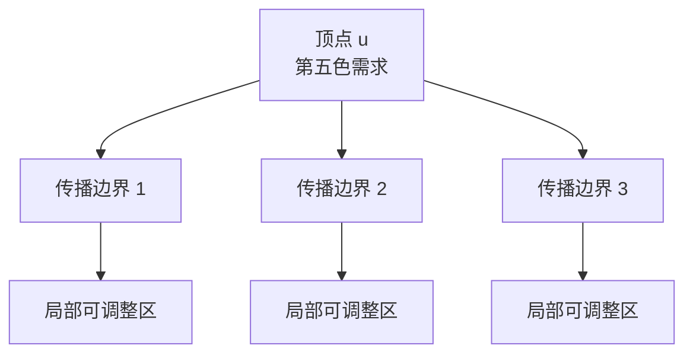

# 第五色需求理论论文草稿

## Fifth-Color Demand Theory: A Structural Draft on Uniqueness over Cubic Planar Maps of Girth Greater Than Three

### 摘要 / Abstract

本文在现有 Fifth-Color Demand Theory（FCD Theory）框架基础上，整理出一篇面向后续严格化证明的论文草稿。文章不直接重证四色定理，而是围绕“第五色需求”这一局部-全局交叉对象，建立一套适用于平面地图着色研究的结构语言。我们的核心目标是刻画如下命题：在最小围长大于 3 的、3-正则的任意平面地图上，最多只有一个顶点具有第五色需求。本文给出该命题所需的定义系统、结构动机、传播图模型、势函数视角以及与不可避免构型、不可避免集之间的关系，并明确区分已经定义的对象、结构性观察以及仍待证明的中心结论。

This paper consolidates the current Fifth-Color Demand Theory framework into a research-oriented draft. Rather than re-proving the Four Color Theorem directly, it develops a structural language centered on fifth-color demand. The central target statement is the following: for any planar cubic map of girth greater than three, at most one vertex can exhibit a fifth-color demand. We provide the definitions, structural motivation, propagation model, potential-function viewpoint, and the relationship with unavoidable configurations and unavoidable sets, while carefully separating established definitions from unproved claims.

---

## 1. 引言

四色问题的经典研究路径主要依赖极小反例、可约构型、卸载法以及 Kempe 链分析。这条路径极其成功，但它主要关注“如何排除一个坏图”或“如何消解一个局部冲突”。FCD Theory 尝试转换研究视角，不再把“是否可四染色”视为唯一基础对象，而是将“哪里出现了第五色需求、它为何不能被局部变换消除、它是否能够与其他同类需求共存”作为首要研究问题。

在这个视角下，第五色需求不是一个结论性的失败标签，而是一个可被分析、传播、约束和计量的结构对象。于是，传统的平面图着色问题可以被重新组织为以下几层研究：

1. 局部可用颜色集如何退化为空；
2. 空需求如何在着色状态空间中保持；
3. 多个需求点之间是否可能相互独立地存在；
4. 平面性、围长与度数限制如何压缩这种共存空间。

本文的目标不是宣布上述核心命题已被完全证明，而是形成一篇逻辑自洽、术语完整、与现有仓库框架一致的论文草稿，使后续工作能够直接在此基础上推进。

---

## 2. 预备定义

### 2.1 平面地图、围长与 3-正则

本文所称平面地图，是指固定嵌入在平面上的连通图；若无特别说明，默认不存在自环与重边。图的围长是其所有简单环长度中的最小值，记为 $g(G)$。当 $g(G) > 3$ 时，图中不存在三角形，因此局部相邻结构不再允许三元面直接制造最紧冲突。

3-正则图（又称 cubic graph）是指每个顶点的度数都恰好等于 3 的图。若一个平面地图既是 3-正则的，又满足 $g(G) > 3$，则它同时具备两种关键约束：

1. 每个顶点的局部分支复杂度固定；
2. 三角形型的最短回路障碍被排除。

### 2.2 颜色需求

设 $G$ 为图，$\varphi$ 为一个部分 4-着色。对于任意顶点 $v$，定义其可用颜色集为

$$
D(v,\varphi)=\{1,2,3,4\}\setminus \{\varphi(u):u\in N(v),\ \varphi(u)\text{ 已定义}\}.
$$

这个集合刻画了在当前局部着色状态下，顶点 $v$ 尚可被赋予的颜色。

### 2.3 第五色需求 / Fifth-Color Demand

若对某顶点 $v$ 有 $D(v,\varphi)=\varnothing$，则称顶点 $v$ 在状态 $\varphi$ 下出现第五色需求，记作

$$
F(v,\varphi)=1.
$$

否则记 $F(v,\varphi)=0$。这是全文的基本局部对象。

Definition in English: A vertex $v$ has a fifth-color demand under a partial 4-coloring $\varphi$ if no color in $\{1,2,3,4\}$ remains available for $v$.

### 2.4 着色状态空间 / Coloring State Space

定义着色状态空间 $\mathcal{S}(G)$ 为：

1. 顶点集是图 $G$ 的所有合法部分 4-着色状态；
2. 若状态 $\varphi_1$ 可通过一次 Kempe 交换变为 $\varphi_2$，则在二者之间连一条边。

这一状态空间使“第五色需求是否可消除”成为一个动态图问题，而不只是单一静态着色快照的问题。

### 2.5 不可避免构型 / Unavoidable Configuration

不可避免构型是指：在某一类目标图族中，任取一张图都必然包含的局部构型。经典四色理论中，不可避免构型与可约构型配对使用，用于说明任何极小反例都必须含有某些局部结构，而这些结构最终又不可能出现在极小反例中。

Definition in English: An unavoidable configuration is a local substructure that must occur in every graph within a specified graph class.

### 2.6 不可避免集 / Unavoidable Set

不可避免集是若干不可避免构型组成的集合，满足目标图族中的每一张图至少包含其中一个构型。它是“局部结构覆盖整个图族”的有限或可描述化表达。

Definition in English: An unavoidable set is a collection of configurations such that every graph in the target class contains at least one configuration from the collection.

在 FCD Theory 中，不可避免构型与不可避免集的角色不是替代第五色需求，而是为第五色需求提供几何宿主与局部约束边界。

---

## 3. 研究动机与结构转向

经典四色理论把注意力集中在“极小不可四染色对象”上，而 FCD Theory 提出另一个更细颗粒度的问题：即便我们暂时只看一个部分着色状态，导致失败的那一个顶点到底具有怎样的结构地位？

这一问题比“图整体是否可四染色”更局部，也更适合定义动态量。因为一个图在不同的部分着色状态下，可能出现不同位置的需求点；真正重要的不是单次失败，而是某类失败在状态空间中是否顽固存在。

因此，本文引入两层核心转向：

1. 从图整体转向着色状态；
2. 从静态冲突转向需求传播。

一旦这种转向成立，“唯一性”问题自然出现：若一个图中可同时存在两个彼此独立的第五色需求顶点，则说明局部冲突不止一个源头；反之，若在强结构限制下最多只能有一个需求核，则着色阻碍在本质上是单核的，而非多核并发的。

---

## 4. 传播图与势函数框架

### 4.1 阻碍传播

若在状态空间中，一个顶点 $u$ 的第五色需求通过任何允许的局部调整都会迫使另一个顶点 $v$ 继续处于空可用颜色状态，则定义有向关系

$$
u \to v.
$$

所有此类关系构成阻碍传播图 $\mathcal{P}(G)$。该图不是原图的子图，而是关于“需求如何被结构锁定”的元图。

### 4.2 第五色核心

定义第五色核心为

$$
C_5(G)=\{v\in V(G): \exists\, \varphi\in \mathcal{S}(G),\ F(v,\varphi)=1\text{ 且该需求在可达状态中持续存在}\}.
$$

这一定义把偶然失败与持续失败区分开来。FCD Theory 的核心问题不是某个顶点是否曾经失败，而是它是否构成持续的阻碍核心。

### 4.3 势函数

定义势函数

$$
\Phi(\varphi)=\sum_{v\in V(G)} F(v,\varphi).
$$

它统计一个着色状态中的第五色需求总数。若未来能证明某类 Kempe 变换严格降低 $\Phi$，则“多需求共存”将受到强限制；若再结合平面性与围长约束，就可能逼出唯一性结论。

---

## 5. 不可避免构型与第五色需求的关系

本文特别补充这一部分，是为了把 FCD Theory 与经典四色技术接轨，而不是让新理论悬浮于旧理论之外。

首先，不可避免构型给出了一种局部几何保证：在平面图族中，不可能所有顶点都处于完全均匀而无特征的环境，总有某些局部结构必须出现。其次，不可避免集将这种“必须出现”压缩为可操作的有限覆盖系统。

FCD Theory 中的关键新视角是：这些不可避免构型不只用于排除极小反例，也可用于定位第五色需求可能寄生、传播、转移或被消除的局部区域。换言之，经典理论中的“构型”在这里被重新解释为“需求动力学的局部舞台”。

对于最小围长大于 3 的 3-正则平面地图，这一点尤其重要。由于不存在三角形，很多最紧局部闭锁会被削弱；由于每个顶点度数都恰为 3，需求传播的分支模式又被统一。于是，不可避免构型虽仍存在，但它们可支持的“多核需求共存机制”被显著压缩。

---

## 6. 中心命题与逻辑支撑

### 6.1 中心命题 / Central Claim

命题草案：在任意最小围长大于 3 的、3-正则平面地图上，最多只有一个顶点有第五色需求。

Central claim: On any planar cubic map of girth greater than three, at most one vertex can exhibit a fifth-color demand.

### 6.2 该命题为何合理

这一命题的合理性来自三层约束的叠加。

第一层是平面性。平面嵌入限制了长程依赖关系的交叉自由度，使多个独立阻碍核更难彼此隔离。

第二层是围长大于 3。三角形被排除后，最短回路长度增加，局部锁死一个顶点所需的颜色压迫必须经由更长路径实现，因此同时制造多个完全独立的空可用颜色顶点会更加昂贵。

第三层是 3-正则。每个顶点只连接三个邻点，这使得局部传播模式被大幅规范化。一个需求点若要稳定存在，往往依赖邻域中接近饱和的颜色配置；而两个相互独立的需求点若同时存在，则周边必须出现两套彼此兼容且互不消解的高张力结构。对平面 3-正则且无三角形的图而言，这种双核结构应当极为受限。

### 6.3 当前逻辑地位

这里必须严格说明：依据仓库当前材料，该命题在本文中应被视为“研究主张”或“中心待证命题”，而不是已经完成的定理。现阶段我们能够严谨给出的，是一套足以承载该命题证明的定义系统与结构路线，而非终局证明本身。

---

## 7. 拟证明路线

为了将中心命题推进为正式定理，本文建议采用以下证明路线：

1. 利用 Euler 公式与平面图平均度约束，说明无三角的 3-正则平面图在面结构上必须表现出可控制的稀疏性。
2. 在状态空间中定义“持续第五色需求”的判别准则，区分瞬时失败与稳定失败。
3. 证明任意两个候选需求核之间若彼此独立，则其间必须存在一段不可压缩传播链。
4. 将这类传播链嵌入平面图的面结构，结合围长约束证明该链不能同时支持两个端点都稳定失色。
5. 借助不可避免构型与不可避免集，将所有潜在双核模式压缩为有限类型，并逐类排除。

如果这一路线完成，则“最多一个需求顶点”的命题可以从直觉性陈述升级为结构定理。

---

## 8. 示例图示

下面给出一个用于说明“单核需求优于双核需求”的概念图。图示不是证明，只是结构直观。

若再加入第二个独立需求点，则这两个传播扇区需要在平面中同时展开而互不消解；在无三角且 3-正则的条件下，这一几何安排会迅速受到压缩。本文将这种压缩视为中心命题最重要的结构来源。

---

## 9. 与仓库三份基础文档的一致性说明

本文与现有框架文档保持如下对应：

1. 与 Framework 文档一致：始终坚持“先定义、后命题、再证明”的顺序；
2. 与 README 一致：将四色定理视为潜在应用，而不是论证起点；
3. 与 ROADMAP 一致：本文属于从 Volume I 过渡到 Volume II 的整合稿，即从对象定义走向结构组织。

也正因为保持这一一致性，本文虽然形成了论文体例，但没有越权把尚未完成证明的结论包装为既成定理。

---

## 10. 结论 / Conclusion

本文完成了当前 FCD Theory 仓库的一次论文化整理。我们将“第五色需求”从一个局部着色失败事件，提升为可定义、可传播、可计量、可与经典构型理论对接的结构对象；补齐了不可避免构型、不可避免集、围长、度数与 3-正则等关键概念；并把核心研究目标明确表述为：在最小围长大于 3 的 3-正则平面地图上，最多只有一个顶点具有第五色需求。

In conclusion, the paper turns the current FCD framework into a coherent structural draft. It does not yet claim a completed theorem, but it provides a precise language and a viable proof program for the uniqueness of fifth-color demand on planar cubic maps of girth greater than three.

下一阶段的关键任务不是继续扩充术语，而是针对“双核需求不可能共存”的局部模式建立有限分类，并给出逐类排除证明。

---

## 参考性备注

本文为仓库内部研究论文草稿，继承并整合以下材料：

1. Fifth-Color_Demand_Theory_Framework.md
2. README.md
3. ROADMAP.md

后续若要提交正式论文版本，建议继续补充：

1. 经典四色与平面图着色文献综述；
2. 不可避免构型的标准引用；
3. 对应的示例图、反例搜索记录与形式化引理链。