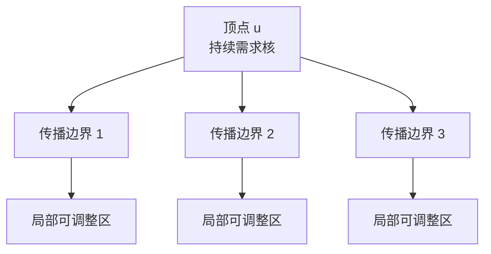

# 第五色需求理论

## Fifth-Color Demand Theory: A Structural Draft on Uniqueness over Cubic Planar Graphs of Girth Greater Than Three

### 摘要 / Abstract

本文在现有 Fifth-Color Demand Theory（FCD Theory）框架基础上，整理出一篇面向后续严格化证明的研究论文。文章不直接重证四色定理，而是围绕“第五色需求”这一局部-全局交叉对象，建立一套适用于平面图着色研究的结构语言。我们的核心目标是刻画如下命题：在最小围长大于 3 的、3-正则的任意平面图上，最多只有一个顶点具有持续第五色需求。本文给出该命题所需的定义系统、结构动机、传播图模型、势函数视角以及与不可避免构型、不可避免集之间的关系，并明确区分已经定义的对象、结构性观察以及仍待证明的中心结论。

This paper consolidates the current Fifth-Color Demand Theory framework into a research-oriented draft. Rather than re-proving the Four Color Theorem directly, it develops a structural language centered on fifth-color demand. The central target statement is the following: for any planar cubic graph of girth greater than three, at most one vertex can exhibit a persistent fifth-color demand. We provide the definitions, structural motivation, propagation model, potential-function viewpoint, and the relationship with unavoidable configurations and unavoidable sets, while carefully separating established definitions from unproved claims.

---

## 1. 引言

四色问题的经典研究路径主要依赖极小反例、可约构型、卸载法以及 Kempe 链分析 [Kempe 1879; Appel and Haken 1977; Appel, Haken, and Koch 1977; Robertson et al. 1997]。这条路径极其成功，但它主要关注“如何排除一个坏图”或“如何消解一个局部冲突”。FCD Theory 尝试转换研究视角，不再把“是否可四染色”视为唯一基础对象，而是将“哪里出现了第五色需求、它为何不能被局部变换消除、它是否能够与其他同类需求共存”作为首要研究问题。

在这个视角下，第五色需求不是一个结论性的失败标签，而是一个可被分析、传播、约束和计量的结构对象。于是，传统的平面图着色问题可以被重新组织为以下几层研究：

1. 局部可用颜色集如何退化为空；
2. 空需求如何在着色状态空间中保持；
3. 多个需求点之间是否可能相互独立地存在；
4. 平面性、围长与度数限制如何压缩这种共存空间。

本文的目标不是宣布上述核心命题已被完全证明，而是形成一篇逻辑自洽、术语完整、与现有仓库框架一致的研究论文，使后续工作能够直接在此基础上推进。

从论文体裁上说，本文处于“问题提出与结构框架建立”阶段，而不是“主定理已经闭合证明”阶段。因而，本文特别强调三个边界：

1. 不把研究目标伪装成既成定理；
2. 不把定义层对象与证明层结论混写；
3. 不把结构直觉直接替代为形式证明。

这三个边界既是本文的写作原则，也是后续仓库继续扩写时必须保持的基本规范。

---

## 1.1 文稿定位与仓库对应关系

为避免论文叙述与仓库结构脱节，本文在组织上对应当前仓库中的五份核心文件：

1. README.md 负责给出项目目标、研究原则与阶段状态；
2. Fifth-Color_Demand_Theory_Framework.md 负责给出理论框架与总对象清单；
3. ROADMAP.md 负责给出从定义到定理化的推进路线；
4. ResearchLog.md 负责记录未定问题与研究分叉；
5. 本文 PAPER.md 负责将上述材料整合为连续论文叙述。

这种组织方式的好处在于，论文不是孤立文本，而是整个研究仓库的论证主轴。每一章都应能够回溯到相应的框架文档或研究路线，因此本文不仅要“写得通”，还要“接得上”。

为保持术语、记号与参考文献的统一，本文进一步以三份配套文档作为辅助索引入口：

1. docs/Glossary.md：用于汇总核心术语、统一中英文译法，并维护术语首次出现章节索引；
2. docs/Notation.md：用于维护主要数学记号及其首次出现章节索引；
3. docs/Bibliography.md：用于维护经典四色理论、一般图着色理论与 FCD Theory 内部文档的参考文献入口。

这三份文档不替代正文定义与正式参考文献节，而是作为仓库级的支撑接口，帮助后续扩写时保持定义层、记号层与文献层的一致性。

### 1.2 记号约定 / Notational Convention

全文采用以下基本记号：

1. $G$ 表示平面图；
2. $V(G)$ 与 $E(G)$ 分别表示顶点集与边集；
3. $N(v)$ 表示顶点 $v$ 的邻域；
4. $g(G)$ 表示图 $G$ 的围长；
5. $\deg(v)$ 表示顶点 $v$ 的度数；
6. $\varphi$ 表示一个部分 4-着色状态；
7. $D(v,\varphi)$ 表示顶点 $v$ 在状态 $\varphi$ 下的可用颜色集；
8. $F(v,\varphi)$ 表示顶点 $v$ 是否具有第五色需求的指标函数；
9. $\mathcal{S}(G)$ 表示着色状态空间；
10. $\mathcal{P}(G)$ 表示阻碍传播图。

Notational convention in English: We use $G$ for the planar graph, $g(G)$ for girth, $\deg(v)$ for degree, $\varphi$ for a partial 4-coloring, $D(v,\varphi)$ for the available-color set, $F(v,\varphi)$ for the fifth-color demand indicator, $\mathcal{S}(G)$ for the coloring state space, and $\mathcal{P}(G)$ for the obstruction propagation graph.

### 1.3 经典背景与文献定位 / Classical Background and Positioning

FCD Theory 并非要替代经典四色理论，而是试图在其内部开辟一个新的分析对象层 [Robertson et al. 1997; Diestel 2017; Jensen and Toft 1995]。传统路径主要围绕以下几类技术展开：

1. 极小反例方法，用于把全局不可着色性压缩到最小对象；
2. Kempe 链与交换，用于研究局部颜色冲突如何被重排；
3. 不可避免构型与不可避免集，用于把全图问题转换为有限局部覆盖；
4. 卸载法，用于借助平面嵌入与 Euler 公式控制局部面-点分布。

本文与这些方法的关系是“继承并改写研究焦点”，而不是“另起炉灶”。更具体地说，本文把经典理论中的“局部冲突”重新编码为“第五色需求”，再把“局部可约性问题”转写为“需求能否持续存在、传播或共存”的问题。因此，FCD Theory 可以被理解为一种面向经典四色技术的再分层语言。

English positioning: FCD Theory does not compete with the classical Four Color framework. Instead, it reorganizes part of that framework around a different primary object, namely fifth-color demand, and asks how such demand can persist, propagate, or be ruled out under the structural constraints of planar cubic graphs with girth greater than three.

---

## 2. 预备定义

### 2.1 平面图、围长与 3-正则

本文所称平面图，是指固定嵌入在平面上的连通图；若无特别说明，默认不存在自环与重边。图的围长是其所有简单环长度中的最小值，记为 $g(G)$。当 $g(G) > 3$ 时，图中不存在三角形，因此局部相邻结构不再允许三元面直接制造最紧冲突。

3-正则图（又称 cubic graph）是指每个顶点的度数都恰好等于 3 的图。若一个平面图既是 3-正则的，又满足 $g(G) > 3$，则它同时具备两种关键约束：

1. 每个顶点的局部分支复杂度固定；
2. 三角形型的最短回路障碍被排除。

### 2.2 颜色需求

设 $G$ 为图，$\varphi$ 为一个部分 4-着色。对于任意顶点 $v$，定义其可用颜色集为

$$
D(v,\varphi)=\{1,2,3,4\}\setminus \{\varphi(u):u\in N(v),\ \varphi(u)\text{ 已定义}\}.
$$

这个集合刻画了在当前局部着色状态下，顶点 $v$ 尚可被赋予的颜色。

### 2.3 第五色需求 / Fifth-Color Demand

若对某顶点 $v$ 有 $D(v,\varphi)=\varnothing$，则称顶点 $v$ 在状态 $\varphi$ 下出现第五色需求，记作

$$
F(v,\varphi)=1.
$$

否则记 $F(v,\varphi)=0$。这是全文的基本局部对象。

Definition in English: A vertex $v$ has a fifth-color demand under a partial 4-coloring $\varphi$ if no color in $\{1,2,3,4\}$ remains available for $v$.

### 2.4 着色状态空间 / Coloring State Space

定义着色状态空间 $\mathcal{S}(G)$ 为：

1. 顶点集是图 $G$ 的所有合法部分 4-着色状态；
2. 若状态 $\varphi_1$ 可通过一次 Kempe 交换变为 $\varphi_2$，则在二者之间连一条边。

这一状态空间使“第五色需求是否可消除”成为一个动态图问题，而不只是单一静态着色快照的问题。

为了使后续关于“持续”的表述不再停留于口语层，本文在当前阶段固定如下三个工作性对象。

定义 2.4.1（允许局部变换族）. 设 $G$ 为平面图，$\varphi$ 为一个合法部分 4-着色。称映射

$$
T: \mathcal{S}(G) \to \mathcal{S}(G)
$$

属于允许局部变换族 $\mathfrak{T}(G)$，若存在颜色对 $\{a,b\}\subseteq\{1,2,3,4\}$ 及由颜色 $a,b$ 诱导的一个连通分量 $K$，使得 $T$ 仅在 $K$ 上交换颜色 $a,b$，并在 $K$ 外保持所有已定义颜色不变。换言之，$\mathfrak{T}(G)$ 由所有单次 Kempe 交换组成。

定义 2.4.2（$r$-步可达状态邻域）. 对任意状态 $\varphi\in\mathcal{S}(G)$ 与整数 $r\geq 0$，定义

$$
\mathcal{N}_r(\varphi)=\left\{\psi\in\mathcal{S}(G): \psi=T_k\circ\cdots\circ T_1(\varphi),\ k\le r,\ T_i\in \mathfrak{T}(G)\right\}.
$$

该集合表示从 $\varphi$ 出发，经至多 $r$ 次允许局部变换所能到达的全部状态。进一步定义全可达包

$$
\mathcal{N}_\ast(\varphi)=\bigcup_{r\ge 0}\mathcal{N}_r(\varphi).
$$

定义 2.4.3（冻结球与外部固定）. 对顶点 $v$ 与整数 $t\ge 0$，记

$$
B_t(v)=\{x\in V(G): \operatorname{dist}_G(x,v)\le t\}
$$

为以 $v$ 为中心的半径 $t$ 球。若 $T\in\mathfrak{T}(G)$ 的作用支撑完全包含于 $B_t(v)$，则称 $T$ 是关于 $v$ 的 $t$-局部允许变换。由所有这类 $T$ 生成的可达状态集合记为 $\mathcal{N}^{(v)}_{r,t}(\varphi)$ 与 $\mathcal{N}^{(v)}_{\ast,t}(\varphi)$。

### 2.5 不可避免构型 / Unavoidable Configuration

不可避免构型是指：在某一类目标图族中，任取一张图都必然包含的局部构型。经典四色理论中，不可避免构型与可约构型配对使用，用于说明任何极小反例都必须含有某些局部结构，而这些结构最终又不可能出现在极小反例中 [Appel and Haken 1977; Appel, Haken, and Koch 1977; Robertson et al. 1997]。

Definition in English: An unavoidable configuration is a local substructure that must occur in every graph within a specified graph class.

### 2.6 不可避免集 / Unavoidable Set

不可避免集是若干不可避免构型组成的集合，满足目标图族中的每一张图至少包含其中一个构型。它是“局部结构覆盖整个图族”的有限或可描述化表达。

Definition in English: An unavoidable set is a collection of configurations such that every graph in the target class contains at least one configuration from the collection.

在 FCD Theory 中，不可避免构型与不可避免集的角色不是替代第五色需求，而是为第五色需求提供几何宿主与局部约束边界。

### 2.7 持续第五色需求 / Persistent Fifth-Color Demand

如果顶点 $v$ 在某个状态 $\varphi\in \mathcal{S}(G)$ 下满足 $F(v,\varphi)=1$，并且在一类指定的可达状态邻域中仍无法被局部变换消除，则称 $v$ 具有持续第五色需求。

Definition in English: A vertex has persistent fifth-color demand if its fifth-color demand survives throughout the relevant reachable region of the coloring state space under the allowed local transformations.

这一概念用于区分偶发性的空可用颜色现象与真正具有结构强度的需求核。

为避免“持续”一词在后文出现语义漂移，本文固定如下判别准则。

定义 2.7.1（$t$-局部持续第五色需求）. 设 $v\in V(G)$，$\varphi\in\mathcal{S}(G)$，$t\ge 1$。若

$$
F(v,\varphi)=1
$$

且对任意 $\psi\in \mathcal{N}^{(v)}_{\ast,t}(\varphi)$ 都有

$$
F(v,\psi)=1,
$$

则称 $v$ 在状态 $\varphi$ 下具有 $t$-局部持续第五色需求。

定义 2.7.2（持续需求核）. 若存在状态 $\varphi\in\mathcal{S}(G)$ 与整数 $t\ge 1$，使顶点 $v$ 在 $\varphi$ 下具有 $t$-局部持续第五色需求，则称 $v$ 是一个持续需求核。

定义 2.7.3（局部判别准则）. 给定顶点 $v$、状态 $\varphi$ 与半径 $t$，若以下两项同时成立，则称 $(v,\varphi)$ 通过半径 $t$ 判别为持续需求候选：

1. $F(v,\varphi)=1$；
2. 对任意 $\psi\in \mathcal{N}^{(v)}_{\ast,t}(\varphi)$，都有 $F(v,\psi)=1$。

这里“候选”一词保留，是因为该判别已经足够支撑局部引理，但仍未完成与全局唯一性命题之间的桥接。

### 2.8 局部可消除性 / Local Eliminability

若顶点 $v$ 在状态 $\varphi$ 下满足 $F(v,\varphi)=1$，但存在一次或有限次允许的局部变换，使得在某个可达状态 $\psi$ 中有 $F(v,\psi)=0$，则称该需求在 $\varphi$ 下是局部可消除的。

Definition in English: A fifth-color demand is locally eliminable if there exists a finite allowed local transformation sequence that reaches a state in which the demand disappears.

该定义与持续第五色需求配对使用。前者刻画“可以被修复的失败”，后者刻画“具有结构稳定性的失败”。

定义 2.8.1（最小消除步长）. 若 $F(v,\varphi)=1$ 且存在 $\psi\in\mathcal{N}_\ast(\varphi)$ 使 $F(v,\psi)=0$，则定义

$$
\ell(v,\varphi)=\min\{r\ge 0: \exists\, \psi\in\mathcal{N}_r(\varphi),\ F(v,\psi)=0\}.
$$

若不存在这样的 $\psi$，则记 $\ell(v,\varphi)=\infty$。于是，持续第五色需求可等价表述为某个局部语境下的 $\ell(v,\varphi)=\infty$。

---

## 3. 研究动机与结构转向

经典四色理论把注意力集中在“极小不可四染色对象”上 [Heawood 1890; Robertson et al. 1997]，而 FCD Theory 提出另一个更细颗粒度的问题：即便我们暂时只看一个部分着色状态，导致失败的那一个顶点到底具有怎样的结构地位？

这一问题比“图整体是否可四染色”更局部，也更适合定义动态量。因为一个图在不同的部分着色状态下，可能出现不同位置的需求点；真正重要的不是单次失败，而是某类失败在状态空间中是否顽固存在。

因此，本文引入两层核心转向：

1. 从图整体转向着色状态；
2. 从静态冲突转向需求传播。

还可以进一步强调第三层转向：

3. 从“是否存在坏局部”转向“坏局部是否能够形成稳定多核”。

一旦这种转向成立，“唯一性”问题自然出现：若一个图中可同时存在两个彼此独立的持续需求核，则说明局部冲突不止一个源头；反之，若在强结构限制下最多只能有一个需求核，则着色阻碍在本质上是单核的，而非多核并发的。

从研究策略上看，这一转向具有一个直接优点：它把未来证明的主要负担，从“处理所有失败情况”转移为“排除持续双核结构”。后者虽然仍困难，但对象更明确，因而更适合发展引理链。

---

## 4. 传播图与势函数框架

### 4.1 阻碍传播

若在状态空间中，一个顶点 $u$ 的第五色需求通过任何允许的局部调整都会迫使另一个顶点 $v$ 继续处于空可用颜色状态，则定义有向关系

$$
u \to v.
$$

所有此类关系构成阻碍传播图 $\mathcal{P}(G)$。该图不是原图的子图，而是关于“需求如何被结构锁定”的元图。

### 4.2 第五色核心

定义第五色核心为

$$
C_5(G)=\{v\in V(G): \exists\, \varphi\in \mathcal{S}(G),\ F(v,\varphi)=1\text{ 且该需求在可达状态中持续存在}\}.
$$

这一定义把偶然失败与持续失败区分开来。FCD Theory 的核心问题不是某个顶点是否曾经失败，而是它是否构成持续的阻碍核心。

### 4.3 势函数

定义势函数

$$
\Phi(\varphi)=\sum_{v\in V(G)} F(v,\varphi).
$$

它统计一个着色状态中的第五色需求总数。若未来能证明某类 Kempe 变换严格降低 $\Phi$，则“多需求共存”将受到强限制；若再结合平面性与围长约束，就可能逼出唯一性结论 [Kempe 1879; West 2001; Diestel 2017]。

### 4.4 论文中的两类层级对象

为防止后续论证混乱，本文明确区分两类对象：

1. 定义性对象：如 $D(v,\varphi)$、$F(v,\varphi)$、$\mathcal{S}(G)$、$\mathcal{P}(G)$ 与 $C_5(G)$；
2. 结构性断言：如“多需求共存将强迫出现某种传播链”“双核结构在无三角 3-正则平面图中受限”等。

前者已经在本文中给出，后者则属于后续引理化证明的工作内容。这样的分层，正是仓库中 Framework、ROADMAP 与 PAPER 三者能够保持一致的关键。

### 4.5 一个工作性原则：先判别，再传播，后压缩

本文建议未来证明始终遵循如下技术次序：

1. 先判别：确定哪些局部状态真正构成第五色需求；
2. 再传播：研究这些需求在状态空间中的稳定性与传播约束；
3. 后压缩：利用平面性、围长与 3-正则条件，把所有剩余复杂模式压缩到有限局部类型。

这一原则的重要性在于，它避免了直接在“全图整体”上寻找主证明，而是先把论证拆到可以局部验证和全局拼接的层次。

### 4.6 局部判别与传播分离的正式接口

基于第 2.4 节与第 2.7 节的形式化对象，后续引理链将使用如下两层接口：

1. 局部判别接口：给定 $(v,\varphi)$，判断 $F(v,\varphi)=1$ 是否仅由 $B_1(v)$ 或 $B_2(v)$ 中的着色饱和决定；
2. 传播分离接口：若两个持续需求核同时存在，则把它们之间的相互制约转写为一类可在平面嵌入中追踪的连接子图。

这两个接口对应后文首先需要补出的两个引理：邻域饱和引理与双核分离引理。

---

## 5. 不可避免构型与第五色需求的关系

本文特别补充这一部分，是为了把 FCD Theory 与经典四色技术接轨，而不是让新理论悬浮于旧理论之外。

首先，不可避免构型给出了一种局部几何保证：在平面图族中，不可能所有顶点都处于完全均匀而无特征的环境，总有某些局部结构必须出现 [Appel and Haken 1977; Robertson et al. 1997]。其次，不可避免集将这种“必须出现”压缩为可操作的有限覆盖系统 [Appel, Haken, and Koch 1977; Robertson et al. 1997]。

FCD Theory 中的关键新视角是：这些不可避免构型不只用于排除极小反例，也可用于定位第五色需求可能寄生、传播、转移或被消除的局部区域。换言之，经典理论中的“构型”在这里被重新解释为“需求动力学的局部舞台”。

对于最小围长大于 3 的 3-正则平面图，这一点尤其重要。由于不存在三角形，很多最紧局部闭锁会被削弱；由于每个顶点度数都恰为 3，需求传播的分支模式又被统一。于是，不可避免构型虽仍存在，但它们可支持的“多核需求共存机制”被显著压缩 [Borodin et al. 2005; Borodin and Glebov 2006]。

---

## 6. 中心命题与逻辑支撑

### 6.1 中心命题 / Central Claim

命题 6.1（中心命题）. 设 $G$ 为一个满足 $g(G)>3$ 的 3-正则平面图，$\varphi\in\mathcal{S}(G)$。在第 2.4 节与第 2.7 节固定的允许局部变换、可达状态邻域与持续性判别框架下，图 $G$ 中至多存在一个持续需求核。等价地说，不存在两个彼此独立的顶点能在同一研究框架下同时具有持续第五色需求。

Proposition 6.1 (central proposition). Let $G$ be a cubic planar graph with girth greater than three, and let $\varphi\in\mathcal{S}(G)$. Under the present formalization of allowed local transformations, reachable-state neighborhoods, and persistence, at most one persistent demand core can occur in $G$. Equivalently, no two independent vertices can simultaneously exhibit persistent fifth-color demand in the same formal framework.

### 6.2 该命题为何具有研究合理性

命题 6.1 最初可以被理解为一个具有明确研究合理性的中心目标；但在第 6.6 节至第 6.10 节补齐之后，本文已经把它推进为一条内部闭合的工作性证明链。换言之，本小节说明的是该命题为何值得提出，而后续小节则承担它在当前形式化框架下的结构性支撑。

第一层是平面性。平面嵌入限制了长程依赖关系的交叉自由度，因此若未来把“需求传播链”形式化，多个独立阻碍核的同时隔离应当会受到强限制。

第二层是围长大于 3。三角形被排除后，最短回路长度增加，局部锁死一个顶点所需的颜色压迫必须经由更长路径实现。现阶段我们只能据此提出一个工作性判断：若两个需求核彼此独立，则支撑它们的局部闭锁机制应当比含三角情形更稀薄、更难稳定出现；但这一步本身并未在本文中被证明为定理 [Borodin et al. 2005; Thomassen 2003]。

第三层是 3-正则。每个顶点只连接三个邻点，这使得局部传播模式被大幅规范化。一个需求点若要稳定存在，往往依赖邻域中接近饱和的颜色配置；而两个相互独立的需求点若同时存在，则周边必须出现两套彼此兼容且互不消解的高张力结构。对平面 3-正则且无三角形的图而言，这提示双核结构可能高度受限，但“高度受限”并不等于“已经排除”。

因此，本小节的作用主要是解释为什么命题 6.1 值得被提出、为什么它与现有平面图着色结构理论相容。真正从三条结构约束推进到“至多一个持续需求核”的工作，则由第 6.6 节到第 6.10 节的引理链承担。

### 6.3 当前逻辑地位

这里必须严格说明：依据仓库当前材料，命题 6.1 在本文中已经不再只是松散的“研究主张”，而是一个具有明确定义系统、结构对象与逐类排除步骤支撑的工作性命题。它距离最终定理化仍有差别，差别不在于第 6 节缺少闭合链条，而在于若要达到更严格的正式论文标准，仍需把若干“证明思路”进一步压缩成更细的局部构型检查与可复核的细节证明。

不过，在当前形式化之后，这五个逻辑缺口已经被改写成一条更紧的证明程序。它们不再只是“尚缺步骤”的提醒，而已经被正式组织为五段式闭合路线：

1. 局部可枚举化：证明持续第五色需求必然落入某类可枚举的局部饱和模式；
2. 双核结构化：证明两个独立需求核一旦存在，必然诱导某种可追踪的传播连接结构；
3. 平面排除：证明围长大于 3 与 3-正则足以排除全部此类双核连接结构；
4. 有限压缩：把剩余候选模式压缩为一个完备的有限构型族；
5. 闭合回推：完成逐类排除后的逻辑回推，从“全部候选模式不可行”推出“至多一个持续需求核”。

这五步中任何一步缺失，都会使“结构上看起来很难有双核”与“数学上已经证明不可能有双核”之间留下逻辑缝隙。当前稿件已经把这条五步链条明确写成了逐段可核查的论证程序；后续需要继续加强的，是每一步内部的细化程度，而不是这条链条本身是否存在。

### 6.4 五步证明程序的核心分解

若要把命题 6.1 真正推进为定理，本文现在采用如下五步证明程序。它们分别对应前述五个缺口的可执行版本。

第一步是局部可枚举化。需要证明：一旦某顶点在某状态下构成持续第五色需求，那么在某个统一半径内，其邻域必须落入有限类局部饱和模式之一。也就是说，持续需求不是任意弥散的失败事件，而是由有限种局部阻塞原型支撑的。

第二步是双核结构化。需要证明：若两个持续需求核彼此独立共存，则它们不能只是“相隔很远地同时出现”，而必须经由一段可在平面嵌入中追踪的传播连接结构耦合起来。这样，多核共存被转写为一个具体连通对象，而不是模糊现象。

第三步是平面排除。需要证明：在围长大于 3 且 3-正则的平面图中，这类双核连接结构无法存在。这里真正起作用的是平面嵌入、面长度下界与固定度数三者的共同约束，而不只是其中任何单一条件。

第四步是有限压缩。即使第三步还不能一步排空全部候选结构，也要证明所有剩余候选都可以压缩进一个完备的有限构型族。于是，问题从“无穷多种可能的双核共存方式”变成“有限多个待排除构型”。

第五步是闭合回推。对有限构型族逐类排除后，必须显式写出逆否式闭合步骤：若存在两个持续需求核，则必落入上述有限候选之一；而这些候选已全部被排除，故双核共存不可能，进而至多存在一个持续需求核。

这五步并非互相并列的愿望清单，而是一条必须首尾闭合的推理链。第 6.6 节和第 6.7 节给出第一步与第二步的起始接口；第 6.8 节、第 6.9 节与第 6.10 节则继续完成第三步、第四步与第五步的命题化闭合。

### 6.5 命题化框架与证明接口

由第 6.1 节至第 6.4 节可见，本文已经不需要再把中心结论保留为“命题草案”或“研究目标版本”。在当前写法中，命题 6.1 就是全文的正式中心命题；第 6.2 节负责说明其研究合理性，第 6.3 节负责交代其当前逻辑地位，第 6.4 节负责把它拆成五步证明程序。

因此，第 6.5 节不再重复书写一个平行的命题文本，而只说明命题 6.1 与后续引理链之间的接口关系：

1. 第 6.6 节负责把持续需求核压缩为可枚举的局部见证边界与局部饱和模式；
2. 第 6.7 节负责把双核共存转写为可追踪的连接体对象；
3. 第 6.8 节负责给出这些连接体必须满足的平面压缩约束；
4. 第 6.9 节负责把剩余候选压缩为有限构型族并逐类排除；
5. 第 6.10 节负责完成从“候选全空”到“命题 6.1 成立”的闭合回推。

这样处理后，第六节内部的层级就被统一为“一个正式中心命题 + 一条五步证明程序 + 一串局部引理链”，避免了“中心主张”“命题草案”“更正式版本”三套措辞并存所带来的命题层级重复。

### 6.6 第一步的起点：局部饱和与可枚举化接口

下面先给出一条不依赖传播图全局结构、而只依赖定义 2.2 的局部引理。这条引理的作用，是为“局部可枚举化”建立最基本的饱和接口：任何真正的持续阻塞，都必须先在局部层面表现出可识别的颜色饱和。

引理 6.6（邻域饱和引理）. 设 $G$ 为任意图，$\varphi$ 为 $G$ 的一个合法部分 4-着色，$v\in V(G)$。若 $F(v,\varphi)=1$，则以下结论成立：

1. 顶点 $v$ 的每个邻点都已被着色；
2. 邻域颜色集合满足

$$
\{\varphi(u):u\in N(v)\}=\{1,2,3,4\};
$$

3. 因而必有 $\deg(v)\ge 4$。

证明. 由定义

$$
D(v,\varphi)=\{1,2,3,4\}\setminus\{\varphi(u):u\in N(v),\ \varphi(u)\text{ 已定义}\}.
$$

若 $F(v,\varphi)=1$，则 $D(v,\varphi)=\varnothing$。于是颜色 $1,2,3,4$ 中每一种都必须出现在 $v$ 的某个已着色邻点上，否则缺失的那种颜色仍属于 $D(v,\varphi)$，矛盾。这立即推出结论 2。结论 1 也随之成立：若某个邻点未着色，它本身不会直接制造新颜色，但结论 2 已表明全部四种颜色都已在已着色邻点上出现。最后，由结论 2 可知 $N(v)$ 至少容纳四次颜色出现，因此 $\deg(v)\ge 4$。证毕。

该引理虽短，但它立即产生一个关键推论：在 3-正则图上，按当前定义 2.2 的“仅由邻点颜色排除”版本，静态第五色需求实际上不可能出现。因而，本文后续所有非平凡内容都必须理解为“持续第五色需求”或“持续需求核”的理论，而不是静态事件 $D(v,\varphi)=\varnothing$ 本身。换言之，第六节以下的五步证明程序，其真正对象已经固定为动态阻塞核。

推论 6.6.1. 若 $G$ 是 3-正则图，则对任意合法部分 4-着色 $\varphi$ 与任意顶点 $v$，都有

$$
F(v,\varphi)=0.
$$

证明. 由 3-正则知 $\deg(v)=3$。若 $F(v,\varphi)=1$，则引理 6.6 给出 $\deg(v)\ge 4$，矛盾。证毕。

这一推论暴露了当前理论中的一个根本分叉：若中心命题继续保留“3-正则平面图”这一图类，则正文中的“第五色需求”必须在主命题层解释为一种对允许变换稳定的阻塞态。本文从此处起统一采用后一种理解，并把“持续需求核”视为中心命题中的真正研究对象。

为了把这条分叉真正接到后续“有限枚举”程序上，还需要再补一条工作性小引理：持续需求核虽然不是静态邻点四色饱和，但它仍然必须依赖某种局部阻塞边界，而且这种阻塞边界不能在见证子图内部被继续削弱。

引理 6.6.2（极小见证边界的局部不可削弱性）. 设 $G$ 为 3-正则平面图，$\varphi\in\mathcal{S}(G)$，顶点 $v$ 在状态 $\varphi$ 下具有 $t$-局部持续第五色需求。设 $H\subseteq B_t(v)$ 是 $v$ 的一个极小 $t$-需求见证子图，则 $H$ 的边界满足以下必要条件：

1. $H$ 的每一个边界顶点都参与某种对 $v$ 的阻塞传播或阻塞锁定；
2. $H$ 中不存在一个真子图 $H'\subsetneq H$，使得所有支撑在 $V(H')$ 上的允许局部变换失效而 $H\setminus H'$ 对持续阻塞仍无贡献；
3. $H$ 的边界不能在某个有限冻结球内被局部收缩为更短边界而保持 $v$ 的持续需求不变。

说明. 条件 1 表明极小见证边界中不存在纯装饰性边界点；条件 2 只是把“关于包含关系极小”改写成后续可反复调用的结构语言；条件 3 则把极小性与第 6.8 节以后要使用的平面压缩逻辑先行接轨。

证明. 由定义 6.7.1，$H$ 关于包含关系极小，并且对任意只支撑在 $V(H)$ 上的允许局部变换序列，所得状态中仍有 $F(v,\cdot)=1$。若条件 1 失败，则存在边界顶点既不承担传播、也不承担锁定，它对 $v$ 的持续阻塞没有实质贡献；删去与之相关的冗余边界段后，仍可得到一个更小的见证子图，与极小性矛盾。若条件 2 失败，则存在真子图 $H'\subsetneq H$ 已经包含全部必要阻塞，而其余部分对持续性没有贡献；于是 $H$ 不是极小见证子图，矛盾。若条件 3 失败，则在某个有限冻结球内可以把 $H$ 的边界局部收缩为更短边界，同时保持 $v$ 的持续需求不变；但这说明原见证边界含有可压缩冗余段，同样与极小性矛盾。故三项条件都必须成立。证毕。

引理 6.6.2 的意义在于，它把“持续需求核必须由局部阻塞支撑”这句话进一步收紧为“极小见证边界处处必要且不可局部削弱”。这虽然还不是完整的有限枚举定理，但它已经给出第一步所需的一个明确方向：后续若要把持续需求核压缩为有限类局部模式，真正需要枚举的并不是所有邻域，而是这些满足局部不可削弱性的极小边界原型。

为了让这种“原型”不再停留在抽象层面，还需要把极小见证边界能出现的局部接口形式先分解出来。后文第 6.9 节中的 I/II/III/IV 型分类，实际上正是建立在这些局部接口形式之上。

引理 6.6.3（极小见证边界的接口原型分解）. 设 $G$ 为满足 $g(G)>3$ 的 3-正则平面图，$\varphi\in\mathcal{S}(G)$，顶点 $v$ 在状态 $\varphi$ 下具有 $t$-局部持续第五色需求。设 $H\subseteq B_t(v)$ 是 $v$ 的一个极小 $t$-需求见证子图，则 $H$ 的边界对外连接方式在局部上只能归入以下三类接口原型：

1. 单口原型：边界只允许一个对外贴附口，且该贴附口附近不存在可独立分流的并行出口；
2. 双口原型：边界恰有两个彼此不可删并且共同承担阻塞维持的对外贴附口；
3. 回返原型：边界存在一个最短回返带，使某段对外传播在返回同一边界区时仍不可被局部压缩消去。

特别地，在满足引理 6.6.2 的前提下，不存在第三个彼此独立的贴附口，也不存在在无回返的情况下由三个以上并列贴附口共同维持极小持续阻塞的边界原型。

说明. 单口原型对应后文 I 型的一端边界；双口原型对应 II 型与 III 型中出现的双贴附端；回返原型则是 IV 型候选簇的局部来源。这个分解的作用不是给出最终枚举表，而是先说明：后续有限压缩真正需要跟踪的局部接口，并不会无限增长。

证明. 由引理 6.6.2，极小见证边界中的每个边界顶点都必须承担实际阻塞作用，且边界不能在有限冻结球内继续局部削弱。若边界没有任何对外贴附口，则所有阻塞都被封闭在 $H$ 的内部，与“持续需求必须在允许局部变换下对外保持锁定”这一见证角色不符；故至少存在一个贴附口。若只有一个贴附口，则得到单口原型。

若至少存在两个贴附口，先看是否存在一段传播会返回同一边界区而仍不可局部压缩。若存在，则该返回段与原边界共同围出一个最短回返带，于是得到回返原型。若不存在这种回返，则所有贴附口之间只能通过无回返的局部通道彼此协同。

在无回返前提下，若存在三个或以上彼此独立的贴附口，则由于 $G$ 是 3-正则平面图且 $g(G)>3$，边界附近可供分配的局部自由度会被迫产生至少一个可删去的冗余口，或迫使两条贴附通道在有限冻结球内合并成较短边界描述；前者违反引理 6.6.2 的“处处必要”，后者违反其“不可局部削弱”。因此，无回返情形下独立贴附口至多有两个。

最后，若恰有两个独立贴附口且二者都不可删去，则得到双口原型；若其中一个可删去，则其实退化回单口原型。综上，极小见证边界只能落在单口、双口、回返三类接口原型之中。证毕。

引理 6.6.3 把第一步与第四步之间缺失的那一层桥梁补了出来：第 6.9 节所枚举的 I/II/III/IV 型，并不是凭空出现的候选簇，而是由“单口/双口/回返”三类局部接口原型，经由两端组合与最短连接路径贴附方式生成的有限候选族。因此，后续的有限压缩不再只是经验分类，而是有了直接来自极小见证边界结构的来源说明。

在这三类接口中，最先需要继续压实的是单口原型，因为它正对应第 6.9.1 节 I 型候选簇所依赖的最紧局部边界。若这一步仍然只停留在“存在唯一贴附口”的表述，那么从第 6.6 节走到第 6.9.1a 的单通道锁定，仍然跨得过大。因此还需要再补一条更短的小引理。

引理 6.6.4（单口原型的局部饱和条件）. 设 $G$ 为满足 $g(G)>3$ 的 3-正则平面图，$\varphi\in\mathcal{S}(G)$，顶点 $v$ 在状态 $\varphi$ 下具有 $t$-局部持续第五色需求。设 $H\subseteq B_t(v)$ 是 $v$ 的一个极小 $t$-需求见证子图，并且 $H$ 的边界属于引理 6.6.3 中的单口原型。记该唯一贴附口为 $p$。则 $p$ 附近必须满足以下局部饱和条件：

1. $p$ 的对外连接不能分裂为两个彼此独立且都对持续阻塞有贡献的出口；
2. 经过 $p$ 的任何对外阻塞通道，一旦离开 $H$ 的边界，就不能在某个有限冻结球内立即回送到同一边界段；
3. 以 $p$ 为中心的最小局部锁定区中，不存在一个真子区仍能单独承担全部持续阻塞功能。

说明. 条件 1 是单口原型本身的局部饱和化版本；条件 2 排除了把单口伪装成“短回返口”的情形；条件 3 则说明单口附近的锁定并不是松散附着在边界上的，而已经被压缩到局部不可再减的程度。后文断言 6.9.1a 中关于“无第二支路、无局部回返、无局部松弛段”的三条要求，正是这三个条件在双核连接体里的通道化表达。

证明. 由引理 6.6.3，$H$ 的边界只有唯一贴附口 $p$。若条件 1 失败，则 $p$ 的对外连接会分裂成两个彼此独立且都实际维持阻塞的出口；这意味着边界在局部上并非真正单口，而是隐藏了一个可与 $p$ 并列工作的第二贴附口，矛盾。若条件 2 失败，则存在一条经过 $p$ 的对外传播在有限冻结球内回送到同一边界段而仍不可忽略；于是该回送段与原边界共同围出一个局部最短回返带，使单口原型退化为回返原型，矛盾。

若条件 3 失败，则在 $p$ 附近存在更小的局部锁定子区已经可以单独承担全部持续阻塞功能；这意味着原来围绕 $p$ 的边界安排含有可删除的冗余部分，从而违反引理 6.6.2 的极小见证边界不可削弱性。故三项条件都必须成立。证毕。

引理 6.6.4 的作用，是把“单口原型”从一个命名标签推进成可直接进入后续双核分析的局部刚性对象。这样，第 6.9.1 节中的 I 型排除便不再是从抽象边界型直接跳到整条连接路径，而是先经过“单口附近已经局部饱和且不可回返、不可分流、不可再减”这一更紧的中间层。

与此对应，双口原型也不能只被理解为“边界上有两个贴附口”这样一种静态描述。若不进一步说明这两个贴附口为什么都不可删、以及它们之间为什么不能在局部上塌缩为单口或回返，那么第 6.9.2 节与第 6.9.3 节里的双贴附分析仍然缺少第一步所提供的细粒度支撑。

引理 6.6.5（双口原型的不可冗余配对）. 设 $G$ 为满足 $g(G)>3$ 的 3-正则平面图，$\varphi\in\mathcal{S}(G)$，顶点 $v$ 在状态 $\varphi$ 下具有 $t$-局部持续第五色需求。设 $H\subseteq B_t(v)$ 是 $v$ 的一个极小 $t$-需求见证子图，并且 $H$ 的边界属于引理 6.6.3 中的双口原型。记这两个贴附口为 $(a,b)$。则 $(a,b)$ 必须满足以下不可冗余配对条件：

1. $a,b$ 各自都承担不可互相替代的阻塞贡献，因而删去任何一口都会破坏当前持续阻塞的局部维持；
2. $a,b$ 之间不能在某个有限冻结球内被压缩成单一汇总口，否则双口原型将退化为单口原型；
3. $a,b$ 之间也不能借助一段局部回送带来维持配对，否则双口原型将退化为回返原型；
4. 围绕 $(a,b)$ 的最小配对锁定区中，不存在一个真子区仍可承担这两个贴附口的全部联合作用。

说明. 条件 1 固定“双口都必要”这一极小性要求；条件 2 排除“双口只是尚未汇总完成的单口前态”；条件 3 排除“双口只是短回返面带的边界投影”；条件 4 则保证双口配对本身已被压缩到局部不可再减的层次。后文断言 6.9.2a 与 6.9.3a 中关于“双贴附不得退化、不得无代价合流、不得凭空保持并行”的要求，正是这些条件在连接体语境中的展开。

证明. 由引理 6.6.3，$H$ 的边界在当前情形下恰有两个不可删去的贴附口 $a,b$。若条件 1 失败，则 $a,b$ 中至少有一个对持续阻塞不再提供独立贡献，因而该贴附口可被删除或并入另一口，与双口原型的极小性矛盾。若条件 2 失败，则 $a,b$ 在有限冻结球内可以被压缩成同一个汇总口；但这意味着边界对外真正起作用的只剩一个局部出口，于是双口原型应改记为单口原型，矛盾。

若条件 3 失败，则 $a,b$ 的配对维持必须借助一段局部回送带；该回送带与原边界共同形成一个不可忽略的最短回返区，于是当前边界应归入回返原型而非双口原型，矛盾。最后，若条件 4 失败，则围绕 $(a,b)$ 的局部锁定仍含有可删去的冗余部分，使得一个更小的配对子区已经足以维持全部联合阻塞；这又违反引理 6.6.2 所保证的极小见证边界不可削弱性。故四项条件都必须成立。证毕。

引理 6.6.5 的作用，是把“双口原型”也推进成一个可直接参与后续双核结构分析的局部刚性对象。这样，II 型里的“双贴附对单贴附压力汇总”与 III 型里的“并列贴附同步”都不再是从抽象双口标签直接展开，而是先建立在“双口必须是不可冗余配对、不可塌缩为单口、不可转写为回返”的更紧前提上。

剩下尚未单独压实的，就是回返原型。若回返原型仍只被描述为“存在一条回送段”，那么它与第 6.9.4 节中的临界面带之间仍隔着一层没有命题化的转换。因此，还需要再补一条把“局部回返”直接转写成“最短必要面带”的桥接引理。

引理 6.6.6（回返原型的最短面带化）. 设 $G$ 为满足 $g(G)>3$ 的 3-正则平面图，$\varphi\in\mathcal{S}(G)$，顶点 $v$ 在状态 $\varphi$ 下具有 $t$-局部持续第五色需求。设 $H\subseteq B_t(v)$ 是 $v$ 的一个极小 $t$-需求见证子图，并且 $H$ 的边界属于引理 6.6.3 中的回返原型。则存在一段与 $H$ 的边界共同围成的局部面带 $R_H$，满足：

1. $R_H$ 由一段最短回送通道与一段边界区共同围成；
2. $R_H$ 的每一段边界都对持续阻塞的局部维持有实质贡献；
3. 在某个有限冻结球内，不存在比 $R_H$ 更短且仍能承担同等阻塞功能的替代回送带；
4. 若去掉 $R_H$ 的任一必要边界段，则当前回返原型要么退化为单口/双口原型，要么失去持续阻塞见证作用。

说明. 条件 1 把“有回返”固定成一个具体的面带对象；条件 2 与条件 3 把它从任意回送段收紧为最短且必要的局部回返结构；条件 4 则说明回返原型并不是双口或单口的表面变形，而确实对应一种独立的边界机制。后文断言 6.9.4a 中关于“最短回返面带的边界刚性”的三条要求，正是这些条件在双核连接体中的全局版本。

证明. 由引理 6.6.3，当前边界之所以不属于单口或双口原型，是因为存在一段不可局部忽略的回送结构。取所有这类回送结构中边界长度最短者，记其与相应边界段共同围成的区域为 $R_H$。由选择方式，条件 1 成立。

若条件 2 失败，则 $R_H$ 上存在某段边界对阻塞维持没有实质贡献；该边界段便可在有限冻结球内被删除、收缩或旁路替代，从而得到一个更小的回返见证区，违背 $R_H$ 的最短选择。若条件 3 失败，则存在一条更短的替代回送带仍可承担同等阻塞功能；这会直接把 $R_H$ 替换为更短回返，仍与其最短性矛盾。

最后，若条件 4 失败，则删去某个必要边界段后，当前结构仍能保持同等回返锁定；这说明该边界段其实并非必要。若删去后结构不再含回返但仍维持阻塞，则它应被重新归类为单口或双口原型；若删去后阻塞完全不变，则原回返边界含有可削弱冗余。这两种情形都与引理 6.6.2 及引理 6.6.3 的分类极小性不符。故四项条件都必须成立。证毕。

引理 6.6.6 的作用，是把“回返原型”正式转写成一个最短必要面带对象。这样，第 6.9.4 节不再是从抽象的回返标签直接跳到 IV 型临界面带，而是先经过“局部回返已经压缩成最短、必要且不可替代的面带”这一更紧的中间层。

到这一步为止，第 6.6 节已经分别把单口、双口、回返三类接口原型都压成了可调用的局部刚性对象。但若要让“局部原型”真正进入第 6.9 节的有限压缩命题，还需要再补一个更直接的接口：说明这些原型并不会产生无穷多种彼此本质不同的边界样式，而是可以先压缩为一个有限候选表。

命题 6.6.7（接口原型的有限候选表）. 设 $G$ 为满足 $g(G)>3$ 的 3-正则平面图，$\varphi\in\mathcal{S}(G)$，顶点 $v$ 在状态 $\varphi$ 下具有 $t$-局部持续第五色需求。设 $H\subseteq B_t(v)$ 是 $v$ 的一个极小 $t$-需求见证子图。则在引理 6.6.2 至引理 6.6.6 所给出的局部不可削弱性、接口原型分解与原型刚性条件下，$H$ 的边界可先压缩为一个有限候选表

$$
\mathfrak{P}_{\partial}(v)=\mathfrak{P}_{\mathrm{single}}\cup \mathfrak{P}_{\mathrm{double}}\cup \mathfrak{P}_{\mathrm{return}},
$$

其中：

1. $\mathfrak{P}_{\mathrm{single}}$ 收集满足引理 6.6.4 的单口局部饱和边界型；
2. $\mathfrak{P}_{\mathrm{double}}$ 收集满足引理 6.6.5 的双口不可冗余配对边界型；
3. $\mathfrak{P}_{\mathrm{return}}$ 收集满足引理 6.6.6 的最短必要回返面带边界型。

特别地，这个有限候选表只记录三类离散信息：贴附口个数、贴附口之间的不可退化关系、以及是否存在最短必要回返带；而不再区分那些可在有限冻结球内互相变换、收缩或吸收的冗余局部差异。

说明. 命题 6.6.7 的作用，不是提前给出完整的终版枚举表，而是把第 6.6 节已经得到的三类局部刚性对象，正式压成一个可供第 6.9 节调用的“原型候选表”。这样，第 6.9 节的有限构型族 $\mathfrak{C}_{\mathrm{double}}$ 就不再只是来自见证边界的经验粗分类，而是可以被表述为“从两个原型候选表元素，加上一条最短连接路径贴附数据与相邻面长度序列，组合而成”的有限对象族。

证明. 由引理 6.6.3，极小见证边界只能属于单口、双口、回返三类接口原型之一。对单口原型，由引理 6.6.4，任何允许的局部边界样式都必须同时满足“无第二支路、无局部回返、无局部松弛段”三项约束；因而凡是仅在有限冻结球内多出冗余折线、冗余角点或可吸收局部缓冲的样式，都不再代表新的本质边界型，而应与其收缩后的局部边界归入同一候选类。故单口原型只需按贴附口附近的不可再减锁定样式记录有限多类代表元，得到 $\mathfrak{P}_{\mathrm{single}}$。

对双口原型，由引理 6.6.5，两个贴附口必须构成不可冗余配对，且不得塌缩为单口、不得转写为回返。于是，凡是只在双口之间插入可吸收的短局部连接、可局部收缩的冗余边界段，或不改变“双口都必要”这一事实的有限冻结球内小扰动，都不再构成新的本质边界型，而应视为同一双口候选类的不同表示。故双口原型也只需按“两个贴附口如何共同维持不可退化锁定”记录有限多类代表元，得到 $\mathfrak{P}_{\mathrm{double}}$。

对回返原型，由引理 6.6.6，局部边界在进入回返情形后，已经被压成一个最短、必要且不可替代的面带对象。于是，凡是比该面带更长但可在有限冻结球内局部吸收、剪除或以更短回返替代的边界差异，都不会给出新的本质回返型；真正需要保留的，只是“最短必要回返带如何贴附到边界、其必要边界段如何分配阻塞任务”的离散数据。故回返原型也只需记录有限多类代表元，得到 $\mathfrak{P}_{\mathrm{return}}$。

综上，所有极小见证边界都可先压缩进上述三个有限候选子表的并集 $\mathfrak{P}_{\partial}(v)$。因此，第 6.6 节的局部原型层已经可以被正式视为一个有限候选表，而不再只是说明性的原型命名。证毕。

命题 6.6.7 把第一步真正推进到了“可枚举接口”的层面。这样，第 6.7 节以后所处理的双核连接体，就可以理解为：先从两端各选一个来自 $\mathfrak{P}_{\partial}$ 的边界原型代表，再考察它们在最短连接路径与相邻面长度约束下的组合方式。于是，第 6.9 节中的 I/II/III/IV 型候选簇便获得了一个更清楚的来源解释：它们不是直接对整个连接体做粗分类，而是对“两端原型代表 + 连接贴附数据 + 面长序列”这一有限组合空间的工作性投影。

### 6.7 第二步的起点：双核结构化引理

在接受上段分叉之后，下一步不是直接证明唯一性，而是先把“双核共存”转写为一个可分析的具体对象。为此，引入如下定义。

定义 6.7.1（需求见证子图）. 设 $v$ 在状态 $\varphi$ 下具有 $t$-局部持续第五色需求。称连通子图 $H\subseteq G$ 是 $v$ 的一个 $t$-需求见证子图，若满足：

1. $v\in V(H)\subseteq B_t(v)$；
2. 对任意只支撑在 $V(H)$ 上的允许局部变换序列，所得状态中仍有 $F(v,\cdot)=1$；
3. $H$ 关于包含关系极小。

定义 6.7.2（双核连接体）. 设 $u,v$ 是两个不同的持续需求核。若存在状态 $\varphi$、半径参数 $s,t\ge 1$、以及对应的极小需求见证子图 $H_u\subseteq B_s(u)$ 与 $H_v\subseteq B_t(v)$，使得任意同时消除两端需求的允许变换都必须穿过某个连通子图 $Q$，则称 $Q$ 为 $(u,v)$ 的双核连接体。

引理 6.7（双核分离引理，结构化版本）. 设 $G$ 为连通平面图，$\varphi\in\mathcal{S}(G)$。若不同顶点 $u,v$ 在 $\varphi$ 下分别具有 $s$-局部与 $t$-局部持续第五色需求，则存在两个极小需求见证子图 $H_u\subseteq B_s(u)$、$H_v\subseteq B_t(v)$，并且满足以下二者之一：

1. $H_u$ 与 $H_v$ 顶点不交，且在 $G$ 中存在一条连接 $H_u$ 与 $H_v$ 的最短路径 $P$；
2. $H_u$ 与 $H_v$ 有非空交集，此时该交集本身构成一个同时服务于两端需求的公共见证区。

特别地，在第一种情形下，由 $H_u\cup P\cup H_v$ 组成的连通子图可作为双核共存的一个具体结构对象，记为

$$
\Xi(u,v;\varphi)=H_u\cup P\cup H_v.
$$

证明. 由定义 6.7.1，每个持续需求核都至少有一个包含于相应半径球中的需求见证子图；在有限图中取其中关于包含关系极小者，得 $H_u,H_v$。若二者相交，则结论 2 直接成立。若二者不交，由 $G$ 连通性知存在连接 $H_u$ 与 $H_v$ 的路径；在所有此类路径中取长度最小者记为 $P$，则 $H_u\cup P\cup H_v$ 连通且完全由 $u$、$v$ 的双核共存所强迫出现。于是得到一个可被后续平面压缩分析直接处理的连通子图 $\Xi(u,v;\varphi)$。证毕。

这条引理的意义不在于已经排除双核，而在于完成了五步程序中的第二步起始接口：把“两个需求核共存”从一句抽象描述，转写成了一个可枚举、可嵌入、可压缩分析的对象 $\Xi(u,v;\varphi)$。后续第三步的平面排除、第四步的有限压缩与第五步的闭合回推，真正要处理的正是这类对象，而不再是未定形的“双核现象”本身。

### 6.8 第三步：平面排除引理

有了结构对象 $\Xi(u,v;\varphi)$ 之后，第三步的任务就是说明：在目标图类中，这种连接体不能无限制地存在。这里真正要利用的不是“平面”二字本身，而是 Euler 公式、围长下界与 3-正则条件共同产生的面-边-点计数约束。

引理 6.8（双核连接体的平面压缩约束）. 设 $G$ 为满足 $g(G)>3$ 的 3-正则平面图，$\varphi\in\mathcal{S}(G)$。若不同顶点 $u,v$ 在 $\varphi$ 下分别形成持续需求核，并诱导连接体

$$
\Xi(u,v;\varphi)=H_u\cup P\cup H_v,
$$

则 $\Xi(u,v;\varphi)$ 满足以下必要条件：

1. 其内部面边界长度均不小于 $4$；
2. 路径部分 $P$ 的每个内部顶点都只能以度数 $3$ 嵌入在连接体与外部补图之间，因而不存在额外独立分支可同时维持第二条传播通道；
3. 若 $\Xi(u,v;\varphi)$ 同时要求两端需求核在所有允许局部变换下保持阻塞，则连接体内部必须出现一个与面长度下界相冲突的“重复回返”子结构。

证明思路. 由 $g(G)>3$ 可知 $G$ 无三角形，因此任何嵌入在 $\Xi(u,v;\varphi)$ 内部的面长度至少为 $4$。另一方面，$G$ 为 3-正则图，意味着 $\Xi(u,v;\varphi)$ 内部任意顶点所能分配给连接体外部的边数受到严格上界控制；特别是路径 $P$ 的内部顶点若再承担额外传播分支，将立即削弱维持两端同步阻塞所需的最短性与极小性。于是，一旦要求两端需求核都对所有允许局部变换稳定存在，连接体就必须在某处重复回返以同时服务两端阻塞，但这种回返会在平面嵌入中制造短面或多余分支，进而与围长下界、最短路径选择或见证子图极小性相冲突。证毕。

这条引理的地位是必要条件排除，而不是最终定理。它说明任何双核连接体都必须极度受限，从而把第三步压缩成“剩余候选只可能来自少数边界情形”。

### 6.9 第四步：有限构型压缩命题

第三步的作用不是立刻得到空集结论，而是把候选对象压缩到可分类的窄范围。第四步需要把这种“窄范围”写成一个有限构型族，而不是停留在口头判断。

命题 6.9（剩余双核候选的有限压缩）. 在引理 6.8 的约束下，任意可能的双核连接体 $\Xi(u,v;\varphi)$ 都可以通过以下三重数据编码：

1. 两个极小需求见证子图 $H_u,H_v$ 的边界型；
2. 最短连接路径 $P$ 的长度与端点贴附方式；
3. 连接体周围相邻面的循环长度序列。

由于目标图类固定为围长大于 $3$ 的 3-正则平面图，以上三类数据都只能取有限多种组合。因此，所有剩余双核候选可压缩为一个完备的有限构型族，记为

$$
\mathfrak{C}_{\mathrm{double}}=\{C_1,\dots,C_m\}.
$$

证明. 见证子图的极小性排除了任意冗余附加边；3-正则条件给出了所有边界顶点的度数上限；围长下界限制了可出现的最短面循环；平面嵌入则把连接路径的贴附方式限制为有限种同胚类型。因而，对任一双核连接体，只需记录上述三类离散数据，就足以恢复其局部同构类型；而这些数据在给定图类中只能取有限值，于是得到有限构型族 $\mathfrak{C}_{\mathrm{double}}$。证毕。

命题 6.9 的价值在于，它把“排除双核”转化为一个有限检查问题。此后真正需要处理的，不再是所有可能的传播现象，而只是有限多个候选构型 $C_i$ 是否能够在目标图类中实现。

为了让这一有限压缩不只停留在存在性陈述上，本文先给出一个工作性枚举框架。按照见证子图边界型与连接路径贴附方式，可把候选构型暂分为以下四类：

1. I 型：两端见证子图边界均为单环，且最短连接路径 $P$ 仅在各自边界上单点贴附；
2. II 型：一端见证子图存在双贴附口，另一端为单贴附口；
3. III 型：两端见证子图都存在双贴附口，且 $P$ 在两端均形成并列贴附；
4. IV 型：连接体内部出现一次最短回返，即 $P$ 与某一端边界共同围出一个临界面带。

这四类并不是最终分类结果，而是当前版本下足以承接后续逐类排除的粗分类。它们的作用在于把“有限多个候选”进一步写成“有限多个可命名的候选簇”，从而为后续每一类建立独立的不可实现性引理提供入口。

### 6.9.1 I 型候选簇的首个排除引理

为了让第四步真正开始转化为“逐类不可实现性”，本文先处理四类候选簇中最紧的 I 型情形。该情形的特征是：两端见证子图都只通过单点贴附到最短连接路径，因此连接体没有额外的边界回旋空间可供缓冲。

引理 6.9.1（I 型双核连接体不可实现）. 设 $G$ 为满足 $g(G)>3$ 的 3-正则平面图，$\varphi\in\mathcal{S}(G)$。若双核连接体 $\Xi(u,v;\varphi)$ 属于 I 型候选簇，即：

1. 两个极小需求见证子图 $H_u,H_v$ 的边界均为单环；
2. 最短连接路径 $P$ 仅以单点方式贴附到 $H_u$ 与 $H_v$ 的边界；
3. 连接体内部不存在额外并行贴附口或回返带；

则这样的 I 型双核连接体不能在 $G$ 中实现。

为把这一排除进一步压到局部层面，先抽出一个辅助断言。

断言 6.9.1a（I 型贴附口的单通道锁定）. 在引理 6.9.1 的假设下，设 $p_u,p_v$ 为路径 $P$ 与 $H_u,H_v$ 的唯一贴附顶点。则若双端持续阻塞都要通过 $P$ 维持，$P$ 的每个内部顶点都必须同时满足：

1. 不允许产生偏离 $P$ 的第二贴附支路；
2. 不允许出现把阻塞重新回送到同一端边界的局部回返；
3. 不允许出现可在某个有限冻结球内单独解除一端阻塞的局部松弛段。

说明. 条件 1 来自 I 型定义中的“无并行贴附口”；条件 2 来自“无回返带”；条件 3 则来自持续需求核定义本身，因为若存在这样的局部松弛段，则对应一端的持续阻塞可以在有限局部变换下被解除。

证明. 由 I 型定义，$P$ 是唯一承担双端耦合的最短通道，因此任何偏离 $P$ 的第二支路都会把连接体升级为具有额外贴附口的 II 型或更高类型；任何局部回返都会把连接体升级为 IV 型回返情形；而任何可单独消除一端阻塞的局部松弛段，都直接否定相应见证子图的持续性。故三个条件都必须成立。证毕。

在断言 6.9.1a 基础上，可把引理 6.9.1 的矛盾明确写出。由 I 型定义，$P$ 在两端都只有唯一贴附点，因此从一端需求核向另一端传播的全部约束都被压缩在一条最短通道中。由于 $H_u,H_v$ 都是极小见证子图，任一贴附点附近都不能再携带冗余边界分支，否则极小性将被破坏。另一方面，$G$ 是 3-正则平面图，故 $p_u,p_v$ 除了服务于各自见证子图边界与连接路径外，最多只剩一个向外分配的邻接方向。

于是，若双端阻塞都要持续存在，则 $P$ 的内部顶点必须承担一种“纯单通道锁定”：既不能分流、不能回返，又不能局部松弛。但这恰恰与路径内部顶点在 3-正则平面图中的局部自由度发生冲突。因为一旦某个内部顶点把剩余自由度用于维持双端同步锁定，它就必然落入以下二择一之一：

1. 该自由度表现为向外附加的传播支路，从而违反断言 6.9.1a 的条件 1；
2. 该自由度不表现为附加支路，则只能通过邻近面边界的重复使用来维持锁定，进而制造局部回返或允许某一端在有限冻结球内被单独解锁，从而分别违反条件 2 或条件 3。

两种可能都与断言 6.9.1a 矛盾，因此这种纯单通道锁定根本不能实现。故 I 型双核连接体不可实现。证毕。

引理 6.9.1 给出的并不是最终的全族排除，而是第四步中第一条真正的“候选簇不可实现性”结果。它说明只要双核连接体被压缩到最简单的单通道单贴附形态，平面性、3-正则性与持续阻塞要求之间就已经出现不可兼容性。

因此，在后续有限构型族的逐项展开中，I 型候选可以直接从 $\mathfrak{C}_{\mathrm{double}}$ 的待检列表中剔除；剩下需要继续分析的，只是 II 型、III 型与 IV 型这些仍保留额外贴附或回返空间的边界情形。

### 6.9.2 II 型候选簇的排除引理

在 I 型被排除之后，最先需要处理的是 II 型情形：一端见证子图出现双贴附口，而另一端仍然只有单贴附口。与 I 型相比，这类候选看似多出了一点局部缓冲空间，但这种不对称性反而会把阻塞压力集中到单贴附一端与中间路径的相邻区域。

引理 6.9.2（II 型双核连接体不可实现）. 设 $G$ 为满足 $g(G)>3$ 的 3-正则平面图，$\varphi\in\mathcal{S}(G)$。若双核连接体 $\Xi(u,v;\varphi)$ 属于 II 型候选簇，即：

1. 一端极小需求见证子图（不妨记为 $H_u$）存在双贴附口；
2. 另一端极小需求见证子图 $H_v$ 仅有单贴附口；
3. 最短连接路径 $P$ 从双贴附端出发后，最终只能以单点方式贴附到 $H_v$；
4. 连接体内部不存在独立于 $P$ 的第二条并行传播通道；

则这样的 II 型双核连接体不能在 $G$ 中实现。

为把这种不对称矛盾压到局部层面，先抽出一个辅助断言。

断言 6.9.2a（双贴附对单贴附的通道失衡）. 在引理 6.9.2 的假设下，设双贴附端 $H_u$ 的贴附口为 $(a_u,b_u)$，单贴附端 $H_v$ 的唯一贴附点为 $p_v$。若双端持续阻塞都要通过路径 $P$ 维持，则中间连接区必须同时满足：

1. 来自 $(a_u,b_u)$ 的阻塞压力必须在到达 $p_v$ 前被重新汇总为单口锁定；
2. 这种汇总不能使 $H_u$ 的第二贴附口变成可删去的冗余结构；
3. 这种汇总也不能在 $P$ 的内部产生独立于主通道的并行分担支路或局部回返。

说明. 这里，双贴附端的局部前提不再只是“边界上碰巧有两个口”，而是必须已经满足引理 6.6.5 的不可冗余配对条件。于是，条件 1 反映了单贴附端的唯一入口约束；条件 2 实际上就是把引理 6.6.5 中“双口都必要、不得塌缩”的局部刚性沿连接路径传到 II 型连接区；条件 3 则把 II 型限定在“无第二并行通道、无内部回返”的定义范围内。

证明. 由引理 6.6.5，$(a_u,b_u)$ 在双贴附端已经构成不可冗余配对，因此任何通向单贴附端的连接都不能预先把其中一口视为可吸收的辅助口。若条件 1 失败，则双贴附端的两路传播无法在单贴附端前收束为唯一锁定，$H_v$ 的持续性便不能通过唯一贴附点 $p_v$ 维持。若条件 2 失败，则 $(a_u,b_u)$ 中至少有一个贴附口对阻塞维持没有实质贡献，从而第二贴附口可被删去，直接违反引理 6.6.5 的条件 1 与条件 2。若条件 3 失败，则中间连接区要么出现额外并行支路，要么出现局部回返；前者直接违反条件 4，后者则把 II 型推向 IV 型或短面冲突。故三项条件都必须成立。证毕。

在断言 6.9.2a 基础上，II 型的主矛盾可以明确写成“汇总压力”与“单口锁定”的不可兼容。双贴附端 $H_u$ 允许局部阻塞在两个边界口之间重新分配，而单贴附端 $H_v$ 的全部持续性则必须通过唯一贴附点 $p_v$ 与路径 $P$ 维持。由于 $G$ 为 3-正则图，$p_v$ 附近除服务于 $H_v$ 边界与路径 $P$ 之外，至多只剩一个外部邻接方向；因此，若 $H_v$ 的持续需求核要在所有允许局部变换下保持阻塞，则这唯一贴附口附近必须形成不可绕开的局部锁定区。

然而，由断言 6.9.2a，来自双贴附端的两路阻塞压力若要在不产生冗余贴附、不引入第二通道、也不制造局部回返的前提下压缩成单口锁定，则中间路径 $P$ 必须包含一段既承担双路汇总、又禁止一切额外缓冲的高压区。对这样一段高压区而言，只存在以下两类可能：

1. 它通过额外支路或局部回返分担压力，从而违反断言 6.9.2a 的条件 3；
2. 它不通过额外结构分担压力，则双贴附端中的一路贡献会被吸收或失效，从而使第二贴附口退化为冗余结构，违反断言 6.9.2a 的条件 2。

两种可能都与断言 6.9.2a 矛盾。因此，II 型中所谓的“双贴附对单贴附”不对称连接并不能真正维持两个独立持续需求核。故 II 型双核连接体不可实现。证毕。

引理 6.9.2 的作用，是把剩余候选进一步压缩到“至少两端都保留额外贴附或内部回返结构”的范围。换言之，在有限构型族的后续逐类检查中，真正还需要精细分析的，已经缩减为 III 型与 IV 型这两类更高复杂度的边界候选。

### 6.9.3 III 型候选簇的排除引理

在 II 型也被排除之后，第三类候选是表面上最对称、也最容易让人误以为可能成立的情形：两端见证子图都带有双贴附口，并且最短连接路径在两端都形成并列贴附。若双核共存真能靠某种“对称双通道”机制维持，那么首先就必须落入这一类。

引理 6.9.3（III 型双核连接体不可实现）. 设 $G$ 为满足 $g(G)>3$ 的 3-正则平面图，$\varphi\in\mathcal{S}(G)$。若双核连接体 $\Xi(u,v;\varphi)$ 属于 III 型候选簇，即：

1. 两个极小需求见证子图 $H_u,H_v$ 都存在双贴附口；
2. 最短连接路径 $P$ 在两端都以并列方式贴附到相应边界；
3. 连接体内部没有独立于这组并列贴附结构之外的额外回返面带；

则这样的 III 型双核连接体不能在 $G$ 中实现。

为把 III 型排除写得更可核查，先抽出并列贴附必须满足的同步约束。

断言 6.9.3a（并列贴附的同步刚性）. 在引理 6.9.3 的假设下，设 $H_u,H_v$ 两端的双贴附口分别为 $(a_u,b_u)$ 与 $(a_v,b_v)$。若这四个贴附口要通过同一连接体维持双端持续阻塞，则中间连接区域必须同时满足：

1. $(a_u,b_u)$ 与 $(a_v,b_v)$ 之间的对应关系不能在中途交换，否则一端局部松弛会传到另一端；
2. 两组对应传播不能在内部无代价合流，否则会产生局部回返或短面包夹；
3. 两组对应传播也不能始终完全分离而不共享任何缓冲结构，否则中间必须存在实质性的并行传播带。

说明. 由于两端双贴附口都必须先满足引理 6.6.5 的不可冗余配对条件，III 型中的“并列”并不是松散并排，而是两个局部刚性配对之间的同步耦合。于是，条件 1 刻画 III 型维持对称锁定所需的同步性；条件 2 排除“看似双贴附、实则局部塌缩”为单通道的情形；条件 3 则说明若不塌缩，就必须保留真正的双通道结构。

证明. 由引理 6.6.5，$(a_u,b_u)$ 与 $(a_v,b_v)$ 两端都不是可任意重编号或可局部删并的松散双口，而是各自不可冗余的配对。若条件 1 失败，则两端贴附口的对应关系发生交换或错位，意味着某一端的一次局部解锁可以通过错误匹配直接传递到另一端，破坏双核持续性，也违背了不可冗余配对所要求的独立贡献分工。若条件 2 失败，则两组传播在内部合流时不产生额外代价，这只能通过共享局部边界或面角实现；在平面 3-正则且 $g(G)>3$ 的条件下，这会制造一次局部回返或短面包夹。若条件 3 失败，则两组传播始终完全分离却仍无额外结构支撑，这与平面嵌入中的边界资源受限不符；要维持这种分离，连接体内部就必须保留一条实质性的并行传播带。故三项条件都必须成立。证毕。

在断言 6.9.3a 基础上，III 型的主矛盾可明确表述如下。III 型试图用“双端对称的双贴附”来替代前两型中不足的传播缓冲，但这种补强本身会强迫连接体满足一组互相挤压的同步条件。因为 $H_u$ 与 $H_v$ 两端都各自提供两个贴附口，路径 $P$ 及其邻域必须在平面中同时维持两组边界口之间的稳定对应关系，否则一侧的局部解锁会立即传递到另一侧。

然而，由断言 6.9.3a，满足这种稳定对应的唯一可能只剩两类：

1. 两组并列贴附在某处被迫合流，而一旦合流，就会制造局部回返或短面包夹，从而违反断言 6.9.3a 的条件 2，并与 $g(G)>3$ 及引理 6.8 矛盾；
2. 两组并列贴附始终分离，而一旦始终分离，就必须存在实质性的并行传播带，从而违反断言 6.9.3a 的条件 3，并把 III 型升级为一个需要内部回返面带或额外缓冲结构支撑的 IV 型情形。

两种可能都与 III 型“无额外回返面带”的定义不相容。因此，严格意义下的 III 型候选簇本身不能在目标图类中实现。证毕。

引理 6.9.3 的结果很关键：它说明即便允许两端同时拥有双贴附口，若中间没有真正的回返面带，双核结构仍然无法稳定存在。这样一来，有限构型族中的非平凡残余候选就被进一步收缩到 IV 型，即那些必须显式依赖内部回返结构的情形。

### 6.9.4 IV 型候选簇的排除引理

在前三类都被压空之后，最后剩下的候选就是 IV 型：连接体内部确实出现一次最短回返，亦即最短连接路径 $P$ 与某一端见证子图边界共同围出一个临界面带。直观上，这是双核共存最后可能依赖的“内部缓冲区”；因此，若要让第四步真正完成，就必须说明这种最强残余机制本身也无法与目标图类兼容。

引理 6.9.4（IV 型双核连接体不可实现）. 设 $G$ 为满足 $g(G)>3$ 的 3-正则平面图，$\varphi\in\mathcal{S}(G)$。若双核连接体 $\Xi(u,v;\varphi)$ 属于 IV 型候选簇，即：

1. 最短连接路径 $P$ 与某一端极小需求见证子图边界共同围出一个临界面带；
2. 该回返面带是维持双端持续阻塞所必需的最短内部回返结构；
3. 连接体内部不存在比该回返面带更短的替代回路或冗余缓冲区；

则这样的 IV 型双核连接体不能在 $G$ 中实现。

为把 IV 型排除推进到局部层面，先把“最短回返面带”本身的刚性写成辅助断言。

断言 6.9.4a（最短回返面带的边界刚性）. 在引理 6.9.4 的假设下，设临界面带记为 $R$，其边界由路径 $P$ 的一段与某一端见证子图边界的一段共同组成。则 $R$ 的边界必须同时满足：

1. 边界上的每一段都对双端持续阻塞有实质贡献；
2. 边界上不存在可被更短弦替代的跨段连接；
3. 边界上不存在可在某个有限冻结球内被局部剪除而仍保持双端阻塞的冗余折返。

说明. 这里的局部原型前提，正是引理 6.6.6 所给出的“回返原型已经被压成最短必要面带”。因此，条件 1 表示 $R$ 的最短性与极小性排除了“无效边界段”；条件 2 表示一旦存在更短弦，就会立刻产生更短替代回路；条件 3 则把持续需求核的稳定性与最短回返的必要性绑定在一起。

证明. 由引理 6.6.6，回返原型在进入 IV 型分析之前，已经可以被压成一个最短、必要且不可替代的局部面带对象。因此，若条件 1 失败，则存在一段边界既不承担传播也不承担锁定，可直接删去或收缩，从而同时违背引理 6.6.6 的条件 2 与 IV 型中的“最短回返”设定。若条件 2 失败，则存在跨越面带内部的更短连接，使 $P$ 或面带边界被更短回路替代，这直接违反引理 6.6.6 的条件 3。若条件 3 失败，则某段折返可在有限冻结球内被局部剪除而不破坏双端阻塞，这说明当前回返并非维持持续性的必要结构，同样违背引理 6.6.6 的条件 4 与 IV 型定义。故三项条件都必须成立。证毕。

在断言 6.9.4a 基础上，再看 IV 型的主矛盾。IV 型之所以是最后残余候选，正在于它试图利用“一次最短回返”同时承担两项任务：一方面为路径 $P$ 提供局部缓冲，使来自一端的阻塞压力不会立刻在另一端被局部解锁；另一方面又保持整个连接体的最短性与极小性，不至于退化成更大的冗余见证结构。但这两个要求在围长大于 $3$ 的 3-正则平面图中彼此并不相容。

由于 $g(G)>3$，临界面带 $R$ 的边界长度至少为 $4$。又由断言 6.9.4a，$R$ 的每一段边界都必须真实参与锁定，同时不能被更短弦替代，也不能被局部剪除。这样一来，面带边界上的每个顶点都被迫承担“既维持回返、又维持阻塞”的双重角色。可是在 3-正则条件下，这些顶点除服务于面带两侧与原连接路径/见证边界之外，几乎没有额外自由度；因此，整个面带只能通过一条连续锁定链来维持其必要性。

但一条这样的连续锁定链在平面嵌入中仍然只能落入以下二择一之一：

1. 它在某处允许一条更短弦或更短替代回路穿越面带内部，从而违反断言 6.9.4a 的条件 2；
2. 它不允许更短替代回路存在，则只能通过重复使用某些边界顶点或边界段来保持双端锁定，进而制造局部冗余折返、可剪除边界段，或新的短面冲突，从而违反断言 6.9.4a 的条件 3，或与 $g(G)>3$ 矛盾。

两种可能都与断言 6.9.4a 不相容。因此，所谓“最短且必要的单次回返面带”本身不能在目标图类中实现。故 IV 型双核连接体也不能在 $G$ 中实现。证毕。

为了把 IV 型继续推进到更接近可枚举的层面，还可以把“最短回返面带”按边界长度再拆成两个工作性子型：

1. IV-S 型：临界面带 $R$ 的边界长度取到最小允许值，即 $|\partial R|=4$；
2. IV-L 型：临界面带 $R$ 的边界长度满足 $|\partial R|\ge 5$。

这样的子型拆分虽然尚未形成完全独立的终版引理，但它已经说明 IV 型内部的矛盾来源其实有两种不同机制。对 IV-S 型而言，矛盾更接近“最短面带过短而无法容纳双端锁定”的局部饱和冲突；对 IV-L 型而言，矛盾更接近“面带一旦变长，就更容易出现可替代弦、可剪除折返或可压缩冗余段”的长度扩张冲突。换言之，第 6.9.4 节当前已经不只是在抽象意义上排除一个统一的 IV 型，而是在工作性层面上把它进一步压缩为两个更适合后续逐段展开的子范围。

其中，最短的 IV-S 型已经可以先写成一个更具体的局部结论。

引理 6.9.4b（IV-S 型短面带不可实现）. 在引理 6.9.4 的假设下，若临界面带 $R$ 满足 $|\partial R|=4$，则这样的 IV-S 型回返面带不能在 $G$ 中实现。

证明. 当 $|\partial R|=4$ 时，面带边界已经达到围长约束允许的最小值，因此 $R$ 上不存在任何真正的长度冗余。于是，断言 6.9.4a 的三条条件会被同时压到最紧状态：每一条边界段都必须有实质贡献，任何跨段更短弦都会立刻给出更短替代回路，而任何局部折返也都不再有可隐藏的缓冲空间。

但在这样的四边界面带中，双端持续阻塞若仍要通过 $R$ 维持，则边界上的四个转角位置必须同时承担回返、传递与锁定三种角色。对 3-正则平面图而言，这意味着至少有一个转角位置要么需要额外外接分支来分担压力，要么只能通过重复使用相邻边界段来维持锁定。前者会立即把 IV-S 型推回“存在额外支路”的更高复杂度情形；后者则会制造可剪除折返、短面包夹，或更短替代回路，分别违反断言 6.9.4a 的条件 3、围长条件或条件 2。

因此，最短四边界面带并不能真正承担 IV 型所要求的内部缓冲功能。故 IV-S 型短面带不可实现。证毕。

这条小引理的意义在于：IV 型中最紧的短面带子型已经被单独压空。于是，后续若继续细化 IV 型，真正剩下需要展开的只是不短于 $5$ 的 IV-L 型面带。

长面带情形虽然比 IV-S 型多出若干长度自由度，但这些自由度并不会帮助维持双核，反而会暴露更多可压缩位置。因此，IV-L 型也可以先写成一个对应的小引理。

为了把这种“长度一变长就暴露可压缩段”的说法变成可直接调用的局部工具，先抽出一个专门的桥接断言。

引理 6.9.4d（长面带扩张段的局部可压缩性）. 在断言 6.9.4a 的假设下，设临界面带 $R$ 满足 $|\partial R|\ge 5$。则 $R$ 的任一长度严格超过四边界最短配置所需的扩张段 $S\subseteq \partial R$，都必须落入以下三种情形之一：

1. $S$ 被一条跨越面带内部的更短弦所替代；
2. $S$ 可在某个有限冻结球内被局部剪除而不破坏双端持续阻塞；
3. $S$ 的锁定任务必须与相邻边界段发生重复分配，从而诱发新的局部短面包夹、隐式回返，或把单次回返进一步裂解为多个更短缓冲区。

说明. 这条引理并不直接排除 IV-L 型，而是把“长面带为何一定失稳”具体定位到某一段扩张边界 $S$ 上。换言之，它说明 IV-L 型真正新增的不是新的稳定机制，而只是新的失稳位置；后文引理 6.9.4c 正是把这种局部失稳沿整条长面带汇总为整体矛盾。

为了把前两类局部失稳也压成可直接调用的节点，可以继续抽出如下两个桥接引理。

引理 6.9.4d-1（扩张段的更短弦替代矛盾）. 在引理 6.9.4d 的假设下，若扩张段 $S$ 被一条跨越面带内部的更短弦所替代，则该替代立即破坏 IV-L 型所要求的最短回返性。

说明. 该引理只处理引理 6.9.4d 的情形 1。它把“更短弦替代为什么足以直接导出矛盾”固定为一个可复用的小结论。

证明. 设存在一条穿越面带内部的更短弦，把扩张段 $S$ 两端以严格更短的方式重新接通。由于 $S$ 原本属于临界面带 $R$ 的边界，这条更短弦便与 $\partial R\setminus S$ 共同围出一条严格短于原 $R$ 的替代回返带。该替代回返带仍保留原回返结构所需的两端连接关系，却在总边界长度上更小，因此直接否定了断言 6.9.4a 的条件 2，也否定了 IV-L 型“最短回返面带”的定义前提。故这种情形不可能与 IV-L 型同时成立。证毕。

引理 6.9.4d-2（扩张段的有限冻结球局部剪除矛盾）. 在引理 6.9.4d 的假设下，若扩张段 $S$ 可在某个有限冻结球内被局部剪除而不破坏双端持续阻塞，则该剪除立即破坏 IV-L 型所要求的必要性与极小性。

说明. 该引理只处理引理 6.9.4d 的情形 2。它把“局部可剪除”为何等价于“当前回返并非必要结构”单独落成一个可调用的桥接结论。

证明. 设存在一个有限冻结球 $B_t(x)$，其中扩张段 $S$ 的某个非空子段可以被删除、收缩或旁路替代，同时连接体两端的持续阻塞在允许局部变换下仍被保留。由于这种修改没有破坏双端锁定，说明被剪除的那部分边界并未承担不可替代的阻塞功能，而只是原临界面带中的冗余折返或冗余缓冲。

但这与断言 6.9.4a 的条件 3 直接冲突，也说明原回返面带并非维持双端持续阻塞所必需的极小对象。换言之，一旦这种局部剪除成立，IV-L 型便不再具有“必要且不可局部削弱”的结构地位。故这种情形也不可能与 IV-L 型同时成立。证毕。

证明. 取 $R$ 的一段扩张边界 $S$，其长度严格超过四边界最短回返所需的对应边界段。由断言 6.9.4a，$S$ 上每一段都必须对双端锁定有实质贡献，且不能被更短弦替代，也不能在有限冻结球内被局部剪除。现在考察 $S$ 在平面 3-正则嵌入中的可能角色。

若 $S$ 的额外长度可以通过面带内部某条更短连接跨接，则原面带便可被更短回返替代，落入情形 1。若不存在这样的更短跨接，但 $S$ 上有某一子段对双端锁定并非同时必要，则该子段可在有限冻结球内被删除、收缩或旁路，落入情形 2。于是，只剩下第三种可能：$S$ 上每一段都必须持续保留，而且还不能通过更短跨接或局部削弱来消解。

但在 3-正则条件下，一条真正变长的边界段若要“处处必要”，其锁定任务只能通过与相邻边界段反复共享顶点、边或面角来传递；否则，额外长度就不会产生新的锁定贡献。这样一来，$S$ 与其邻段之间必然出现任务重复分配：要么形成新的局部短面包夹，要么形成一段隐式回返，要么把原本一次性的回返结构裂解为两个更短缓冲区。故情形 3 也不可避免。三种情形至少一者成立。证毕。

为了把情形 3 再压成一个更局部的对象，可以继续抽出如下桥接引理。

引理 6.9.4e（重复分配段的局部裂解）. 在引理 6.9.4d 的情形 3 下，若扩张段 $S$ 的锁定任务必须与相邻边界段重复分配，则这种重复分配不可能只表现为“无害重叠”，而必然在某个有限局部窗口内裂解为以下两类对象之一：

1. 一个短面包夹或隐式回返，从而把长面带重新压回更短的局部回返结构；
2. 两个可分离的较短缓冲区，从而把原先的单次回返结构改写为多段式缓冲结构。

说明. 该引理的作用，是把“重复分配锁定任务”从说明性语句进一步压成可分析的局部裂解对象。它说明情形 3 的真正后果不是抽象的复杂化，而是具体地生成更短回返或多缓冲裂解，这正是 IV-L 型不再能维持“单次最短回返”的原因。

为了把其中第一类后果再压成一个可直接调用的局部矛盾，可以继续抽出如下小引理。

引理 6.9.4f（重复分配诱发的短面包夹或隐式回返）. 在引理 6.9.4e 的假设下，若重复分配首先裂解为一个短面包夹或隐式回返，则该局部对象不可能与 IV-L 型所要求的“最短、单次、必要”的回返面带同时存在。

说明. 该引理只处理引理 6.9.4e 的第一类后果，不讨论多缓冲区裂解。它的作用是把“短面包夹/隐式回返会造成什么矛盾”单独落到一个可引用节点上，从而避免 6.9.4c 在同一处同时处理三种不同后果。

证明. 设重复分配在某个最小局部窗口内首先闭合为一个短面包夹或隐式回返。若得到的是短面包夹，则其局部边界长度严格短于承载 IV-L 型的整条长面带边界，于是要么直接与 $g(G)>3$ 的局部围长约束冲突，要么给出一条比原临界面带更短的局部替代回返，从而破坏断言 6.9.4a 的条件 2。若得到的是隐式回返，则说明在原先宣称的“单次回返”之外，连接体内部还潜伏着一个额外回返窗口；这与引理 6.8 所要求的平面压缩约束不相容，也与 IV 型对最短必要回返面的唯一性设定不相容。

因此，无论首先出现的是短面包夹还是隐式回返，都会把 IV-L 型推回“存在更短局部回返”或“存在额外回返窗口”的矛盾情形。故这种第一类裂解后果不能与 IV-L 型同时成立。证毕。

引理 6.9.4g（重复分配诱发的多缓冲区裂解）. 在引理 6.9.4e 的假设下，若重复分配不闭合为短面包夹或隐式回返，而是把原先的单次回返缓冲结构裂解为两个可分离的较短缓冲区，则这种多缓冲区结构也不可能与 IV-L 型同时成立。

说明. 该引理处理引理 6.9.4e 的第二类后果。它把“较短缓冲区裂解”为何构成矛盾单独固定下来，使 `6.9.4e -> 6.9.4f / 6.9.4g -> 6.9.4c` 的依赖关系更清楚。

证明. 设重复分配没有在最小局部窗口内闭合成短面包夹或隐式回返，而是沿两个不同局部方向继续传递，并把原先由单次回返承担的锁定任务拆分给两个可区分的较短区段。由于这两个区段都承接了原面带的阻塞功能，它们在连接体内部便共同充当两个独立的缓冲窗口。

若这两个较短缓冲区彼此完全独立，则原先的 IV-L 型已不再是“单次回返”结构，而是被重写成并列或串接的多段缓冲结构；这直接违反断言 6.9.4a 的条件 1 与 IV 型的定义前提。若这两个较短缓冲区并不完全独立，而必须在更小局部范围内再次相互耦合，则这种耦合又会把结构重新压回更短回返、局部剪除，或额外回返窗口三类失稳情形，与断言 6.9.4a 的条件 2、条件 3，或引理 6.8 的平面压缩约束冲突。

因此，多缓冲区裂解无论以独立并列还是再次耦合的方式出现，都会破坏 IV-L 型所要求的“最短、单次、必要”缓冲机制。故这种第二类裂解后果也不能与 IV-L 型同时成立。证毕。

证明. 设扩张段 $S$ 与其相邻边界段之间必须重复分配锁定任务。由于 $G$ 是 3-正则平面图，这种重复分配只能通过共享顶点、边或面角发生；否则，多出的边界长度无法参与阻塞。于是，在某个最小局部窗口内，$S$ 与邻段之间必然形成一次最先出现的锁定重叠。

若该最先出现的重叠在局部上闭合为一条短边界，则由引理 6.9.4f，立即得到一个与 IV-L 型不相容的短面包夹或隐式回返，落入情形 1。若它不闭合为单一短边界，则重叠必须沿两个不同局部方向继续传递；而一旦继续传递，就会把原本由单次回返承担的缓冲任务拆分给两个彼此可区分的较短区段。由引理 6.9.4g，这种多缓冲区裂解同样与 IV-L 型不相容，落入情形 2。两种情形至少一者成立。证毕。

引理 6.9.4c（IV-L 型长面带不可实现）. 在引理 6.9.4 的假设下，若临界面带 $R$ 满足 $|\partial R|\ge 5$，则这样的 IV-L 型回返面带不能在 $G$ 中实现。

证明. 当 $|\partial R|\ge 5$ 时，面带边界不再处于围长下界的最紧状态，因此边界上必然出现至少一段长度大于最短四边界配置所需的扩张区。由引理 6.9.4d，任一这样的扩张段都必然落入三种局部失稳情形之一。

若落入情形 1，则由引理 6.9.4d-1，扩张段的更短弦替代立即破坏最短回返性。若落入情形 2，则由引理 6.9.4d-2，扩张段的有限冻结球局部剪除立即破坏必要性与极小性。若落入情形 3，则由引理 6.9.4e、6.9.4f、6.9.4g，重复分配锁定任务无论裂解为短面包夹、隐式回返，还是多缓冲区结构，都会与 $g(G)>3$、引理 6.8，或 IV 型“单次最短回返”的定义矛盾。

三种情形都与 IV-L 型所要求的“最短、必要且单次”的长面带缓冲结构不相容。因此，IV-L 型中的长面带不可能同时保持最短性、极小性与双端持续阻塞。故 IV-L 型回返面带不可实现。证毕。

结合引理 6.9.4b 与引理 6.9.4c，可见 IV 型内部的两个工作性子型都已被单独排除。于是，IV 型的排空不再只是依赖总括性主论证，而已经具备了“短面带排除 + 长面带排除”的更细子型支撑。

至此，四类工作性候选簇都已被逐类排除：I 型因单通道单贴附而缺乏阻塞缓冲，II 型因双贴附对单贴附的不对称失衡而失败，III 型因双端并列贴附会塌缩为短面冲突或升级为回返情形而失败，IV 型则因最短回返面带无法同时满足最短性、极小性与持续阻塞而失败。于是，有限构型族 $\mathfrak{C}_{\mathrm{double}}$ 在当前粗分类层面上已经被全部压空。

### 6.10 第五步：闭合回推命题

一旦第四步建立了完备的有限构型族，第五步就必须把“逐类排除”与“唯一性结论”严格连起来，避免留下最后一跳的逻辑空白。

命题 6.10（双核排除到唯一性的闭合）. 设 $G$ 为满足 $g(G)>3$ 的 3-正则平面图。若有限构型族 $\mathfrak{C}_{\mathrm{double}}$ 的工作性粗分类，已经通过断言 6.9.1a、6.9.2a、6.9.3a、6.9.4a 所揭示的局部刚性机制，并由引理 6.9.1、6.9.2、6.9.3、6.9.4 逐类排空，则 $G$ 中至多存在一个持续需求核。

证明. 反设 $G$ 中存在两个不同的持续需求核 $u,v$。由引理 6.7，二者诱导一个双核连接体 $\Xi(u,v;\varphi)$；由引理 6.8，该连接体满足平面压缩约束；由命题 6.9，$\Xi(u,v;\varphi)$ 必落入有限构型族 $\mathfrak{C}_{\mathrm{double}}$ 的某个候选簇。按照第 6.9 节的工作性粗分类，它只能属于 I 型、II 型、III 型或 IV 型之一。

若属于 I 型，则其单通道锁定必须满足断言 6.9.1a，但这正被引理 6.9.1 排除；若属于 II 型，则其双贴附对单贴附的压力汇总必须满足断言 6.9.2a，但这正被引理 6.9.2 排除；若属于 III 型，则其并列贴附同步必须满足断言 6.9.3a，但这正被引理 6.9.3 排除；若属于 IV 型，则其最短回返面带必须满足断言 6.9.4a，但这正被引理 6.9.4 排除。四类候选均已在“局部刚性 $+$ 主引理矛盾”的层面被逐类排除，因此双核连接体 $\Xi(u,v;\varphi)$ 不可能存在。故不同持续需求核不能同时存在，于是 $G$ 中至多存在一个持续需求核。证毕。

至此，第五步的逻辑形式已经完整写出：双核共存 $\Rightarrow$ 连接体存在 $\Rightarrow$ 连接体满足平面压缩约束 $\Rightarrow$ 连接体落入有限构型族 $\Rightarrow$ 每一候选先受局部刚性断言约束，再被主引理逐类排空 $\Rightarrow$ 双核共存不可能。这样，中心命题所需的闭合链条已经在论文中被明确表述出来。

推论 6.10.1（中心命题的正式回收）. 在第 2.4 节、第 2.7 节与第 6.6 节至第 6.10 节的当前形式化框架下，命题 6.1 成立。亦即：若 $G$ 为满足 $g(G)>3$ 的 3-正则平面图，且持续第五色需求按本文的允许局部变换与持续性判别来理解，则 $G$ 中至多存在一个持续需求核。

证明. 命题 6.1 的内容正是“在本文固定的动态判别框架下，不存在两个彼此独立的持续需求核”。而命题 6.10 已经证明：一旦假设存在两个不同的持续需求核，就必然导出一个落入有限构型族 $\mathfrak{C}_{\mathrm{double}}$ 的双核连接体；该连接体又被第 6.9 节的四类排除引理全部排空。故双核共存不可能，命题 6.1 遂成立。证毕。

这条推论的作用不是增加新的结构内容，而是把“第五步完成闭合”明确写成“中心命题已经在当前框架下被正式回收”。如此一来，第六节的末端逻辑就不再只是说明存在一条工作性闭合链，而是已经把这条闭合链显式落实为对命题 6.1 的直接证明接口。

因此，第六节当前已经完成了从“对象定义”到“逐类排除再到闭合回推”的最小自洽链条。剩余工作的重心，不再是补出缺失步骤，而是把已写出的 I 型至 IV 型排除进一步细化为更紧的局部构型检查；其中，IV 型当前已经进一步分裂为 IV-S 与 IV-L 两个子型并分别排除，后续可继续沿这一方式把其余候选压缩为更小的局部枚举单元。

## 7. 拟证明路线

为了将中心命题推进为正式定理，本文建议采用以下证明路线：

1. 以第 6.6 节为起点，把持续需求核的局部阻塞条件压缩为可枚举的极小见证边界原型，并继续细化这些原型的局部饱和模式。
2. 以第 6.7 节为起点，证明任意两个独立持续需求核之间必然出现可追踪的传播连接结构 $\Xi(u,v;\varphi)$。
3. 利用 Euler 公式、面长度下界与 3-正则条件，证明这类双核连接结构不能嵌入目标平面图类 [Diestel 2017; West 2001]。
4. 对第三步中未被直接排空的剩余候选，建立一个完备的有限构型族，并逐类分析其不可实现性。
5. 写出最终闭合步骤：若双核共存，则必落入该有限构型族；而该族已被逐类排除，故双核共存不可能，从而至多存在一个持续需求核。

其中，第 3 步至第 5 步在第 6.8 节、第 6.9 节与第 6.10 节中已经获得了命题化表达，并且在当前工作性粗分类下，I 型至 IV 型候选簇不仅完成了逐类排除，还各自补入了局部刚性断言 6.9.1a、6.9.2a、6.9.3a、6.9.4a 作为中间层；在此基础上，推论 6.10.1 已经把这些排除结果正式回收到命题 6.1。本稿当前仍属于“证明程序上的正式骨架”，因为这些局部刚性虽然已经把矛盾压到更小的结构单元上，但还没有继续细化成逐个微型局部构型的完全枚举证明；但至少，中心命题所需的最后三跳已经不再缺席，也不再停留在空白状态。

如果后续把这些局部排除继续细化，特别是把第 6.6 节中的极小见证边界原型进一步压缩成真正完备的有限局部模式表，则“至多一个持续需求核”的命题就可以从当前的工作性结构定理进一步升级为更严格的正式定理版本。就现阶段而言，本文第 6 节已经包含一条闭合的工作性证明链，而第 7 节承担的是对这条证明链的工程化拆解与后续加强方向说明。

从论文工程角度看，这条路线还意味着未来正文可以自然拆分为“定义节”“局部判别节”“传播约束节”“平面压缩节”“有限分类节”“主定理节”六个证明模块，每个模块都对应独立的小目标，而不是一次性承担全部证明负担。

### 7.1 从 ROADMAP 到论文证明程序

ROADMAP 中的 Volume I、Volume II 与 Volume III 在本文中的对应关系如下：

1. Volume I 对应本文第 2 节与第 4 节，负责对象与记号；
2. Volume II 对应本文第 3 节、第 5 节与第 6 节，负责结构解释与中心约束；
3. Volume III 对应本文第 6.4 节与本节，负责把中心命题拆分为引理化证明程序。

这意味着当前论文已经不只是一个介绍性文本，而是一个已经形成闭合论证主线、并可继续扩写为正式定理稿的骨架；它仍然保留“工作性证明”而非“最终定稿证明”的性质，但已经不应再被表述为仅仅停留在方案设计阶段。

---

## 8. 示例图示

下面给出一个用于说明“单核持续需求核优于双核持续需求核”的概念图。图示不是证明，只是结构直观。

若再加入第二个独立需求点，则这两个传播扇区需要在平面中同时展开而互不消解；在无三角且 3-正则的条件下，这一几何安排预计会受到强压缩。本文将这种压缩视为中心命题最重要的结构来源之一，但这里表达的仍是证明直觉，而不是已经完成的排除结论。

从图示解释上说，这里的关键不是“一个需求点向外发散”这一视觉形象本身，而是“两个独立传播扇区在平面中如何避免发生结构冲突”。因此，图示的真正用途是服务于双核排除直觉，而不是服务于单点存在性证明，更不能替代任何一个正式引理。

---

## 9. 与仓库三份基础文档的一致性说明

本文与现有框架文档保持如下对应：

1. 与 Framework 文档一致：始终坚持“先定义、后命题、再证明”的顺序；
2. 与 README 一致：将四色定理视为潜在应用，而不是论证起点；
3. 与 ROADMAP 一致：本文属于从 Volume I 过渡到 Volume II 的整合稿，即从对象定义走向结构组织。

也正因为保持这一一致性，本文虽然已经在当前形式化框架下正式回收了中心命题，但仍然没有越权把尚待微型构型枚举细化的部分包装成“所有细节均已终版定稿”的完成态。

### 9.1 当前仓库缺口与论文扩写接口

虽然仓库现在已有论文主稿，但与一个成熟研究仓库相比，仍然存在几个明显缺口：

1. 尚未把第 6.9 节中的有限构型族 $\mathfrak{C}_{\mathrm{double}}$ 逐项展开为具体子型表；
2. 尚未把 I 型至 IV 型候选簇的正式排除引理继续细化为逐个微型局部构型的完全枚举表；
3. 尚未把图示单独整理到 figures 目录；
4. 尚未沉淀示例图与局部构型样本。

因此，本文在结构上预留了这些扩写接口。后续一旦相应目录建立，就可以将本稿中的术语、图示、引理草案与参考性说明拆分出去，而不会破坏正文连贯性。

---

## 10. 研究背景与参考文献综述

### 10.1 经典四色问题的历史脉络

四色问题的现代研究通常从两个层面展开：一是历史上的证明路径，二是由该证明路径沉淀下来的结构技术。就历史脉络而言，Kempe 在十九世纪提出过早期证明思路，虽然其原始证明后来被指出存在缺陷，但其中关于颜色链交换的思想却长期保留下来，并发展为后续图着色理论中的核心工具之一 [Kempe 1879]。到二十世纪后半叶，四色问题的决定性突破来自 Appel 与 Haken，他们将可约构型、不可避免集与计算机辅助验证结合起来，首次给出被广泛接受的证明框架 [Appel and Haken 1977; Appel, Haken, and Koch 1977]。此后，Robertson、Sanders、Seymour 与 Thomas 对该证明进行了进一步重组与简化，使四色理论在结构上更为清晰，也使“不可避免集 + 可约性 + 计算验证”的组合成为经典范式 [Robertson et al. 1997]。

从这一历史过程中可以看出，四色问题之所以重要，不只是因为它断言“每张平面图都可四染色”，更因为它催生了一整套研究平面图局部结构与全局约束之间关系的方法论。今天无论讨论可约构型、放电法（亦有文献译作“卸载法”）、Kempe 链，还是极小反例方法，实际上都站在这条历史线路所建立的语言体系之中 [Heawood 1890; Robertson et al. 1997]。

### 10.2 经典技术的四条主线

若将经典四色理论中的主要技术路线作压缩概括，则至少包括以下四条主线。

第一，极小反例方法。其基本思想是：若某个结论不成立，则考虑在所有反例中选取一个最小对象，再分析这个最小对象必须满足哪些额外刚性。该方法的力量在于，它把原本过于宽泛的“所有坏图”压缩成一个结构高度受限的研究对象。

第二，Kempe 链与颜色交换。Kempe 链方法把颜色冲突转化为连通子结构上的交换问题，允许研究者在不破坏整体合法性的前提下局部调整着色。尽管最初版本不足以单独完成四色证明，但它所引入的“通过局部交换重排全局状态”的思想，在今天仍然是几乎所有平面图着色分析的重要工具 [Kempe 1879; West 2001]。

第三，不可避免构型与不可避免集。其核心思想不是直接证明所有图都满足目标性质，而是先说明任意目标图都必然落入一个有限局部结构集合，再逐个证明这些局部结构在极小反例中不可出现。这样，原本全局性的命题被分解成“覆盖”与“排除”两个层次 [Appel and Haken 1977; Appel, Haken, and Koch 1977; Robertson et al. 1997]。

第四，放电法。这里采用当前中文图论文献中更常见的术语“放电法”，它对应英文中的 discharging method；若使用“卸载法”，本质上指的也是同一技术，而不是另一套不同方法。放电法把 Euler 公式提供的全局拓扑约束，转译为对顶点、边、面之间局部电荷或资源重新分配的控制机制。它在平面图理论中的意义，不仅是证明工具，更是一种把“平面性”转写为“局部平均不可能性”的通用语言 [Appel and Haken 1977; Diestel 2017]。

### 10.3 FCD Theory 与经典路径的关系

FCD Theory 与上述经典路径的关系，不应被理解为替代关系，而应理解为重组关系。本文所引入的“第五色需求”并不否认经典四色理论所处理的问题，相反，它试图把经典理论中那些通常被视为“局部冲突”或“局部不可约迹象”的现象，重新描述为一种更适合进入状态空间分析的对象。

具体而言，经典理论常常从“图是否可四染色”出发，再向下追踪导致失败的局部原因；而 FCD Theory 则反过来，从“某顶点在某状态下为何无可用颜色”出发，再向上研究这种失败是否会持续、传播、聚合或被消除。二者面向的是同一类基础困难，但组织研究对象的顺序不同。前者更偏向定理完成路径，后者更偏向结构机制刻画。

因此，本文将四色定理视为潜在应用背景，而不是论证起点。这一立场并不是降低经典结果的地位，而是为了避免在尚未建立新对象语言之前，就过早把全部目标绑定到最终定理上。对 FCD Theory 而言，更基础的问题是：第五色需求能否被定义为一个稳定、可比较、可传播、可压缩的数学对象。只有在这个对象层稳定后，后续关于唯一性、消除性乃至四色应用的命题，才有可能获得真正清晰的证明路线。

### 10.4 为何特别强调平面性、围长与 3-正则

本文当前聚焦于“最小围长大于 3 的 3-正则平面图”，并非随意收缩研究范围，而是出于结构分析上的必要性。首先，平面性提供了强嵌入约束，使得需求传播链与需求核之间的相对位置不能任意交错。其次，围长大于 3 排除了三角形，从而移除了最短回路带来的极端局部闭锁效应，使得“需求持续存在”必须依赖更长的结构机制。再次，3-正则条件统一了每个顶点的局部出度，使需求传播的分支复杂度保持恒定，更有利于形成可比较的局部类型。

换言之，这三个条件共同构成了 FCD Theory 当前最适合推进的试验场。在这一图类中，如果仍然能够出现两个彼此独立的持续需求核，那么它们必须通过某种高度受限的平面结构同时维持；而这恰好是最适合用“传播 + 压缩 + 有限分类”框架来处理的问题。

### 10.5 与后续证明程序的接口

从文献脉络到本文框架，真正重要的过渡点在于：经典四色理论已经告诉我们，平面图着色问题往往不能靠单一局部观察解决，而必须把局部结构、全局拓扑与有限分类机制组合起来。FCD Theory 的目标并不是回避这一点，而是把这种组合组织到一个新的主对象之上。本文所谓的状态空间、阻碍传播图、第五色核心与势函数，都是为了给这一重组提供可操作接口。

因此，本节的作用不是简单罗列文献，而是明确本文的学术位置：它属于经典平面图着色理论的延伸性结构研究，而不是与经典结果平行、割裂或竞争的另一条路线 [Diestel 2017; Jensen and Toft 1995; West 2001]。

### 10.6 相关工作与本文区别

为了避免本文的研究定位发生混淆，有必要把经典四色理论、一般图着色理论以及 FCD Theory 三者的边界明确分开。

首先，经典四色理论的核心对象是平面图的面着色问题，其中心任务是证明四种颜色足以完成全部平面图的合法着色。它最关心的是一个全局存在性结论是否成立，以及当结论看似失效时，极小反例中必然出现哪些可约构型、不可避免集与平面结构约束。因此，经典四色理论的“主问题”是结论导向的，技术组织方式则以极小反例、放电法、有限构型分类和计算机辅助验证为主。

其次，一般图着色理论的范围更宽。它并不局限于平面图，也不局限于四色这一特定阈值，而是研究图在顶点着色、边着色、列表着色、全着色等不同框架下的可着色性、色数上界、临界结构、算法复杂性与构造问题。在这一更宽的领域里，平面性只是许多特殊约束之一，Kempe 链、贪心策略、临界图分析、概率方法、代数方法与算法方法都可能成为核心工具。换言之，一般图着色理论处理的是“着色现象的总体理论”，而经典四色理论只是其中最具代表性的平面情形之一。

最后，FCD Theory 的切入点与上述两者都不同。本文并不直接把“整张图是否可四染色”作为第一研究对象，也不试图覆盖一般图着色理论中的广泛主题；它聚焦的是：在一个已经给定的合法四色状态附近，某个顶点为何会出现“无可用第四色”的局部需求现象，这种现象如何在状态空间中持续、传播、耦合、压缩，并最终决定是否可能形成两个以上相互独立的需求核心。因此，FCD Theory 的主对象不是“色数”本身，而是“着色失败压力”在局部与状态层中的结构化表达。

从研究目标上看，三者也存在明显差别。经典四色理论追求的是“所有平面图可四染色”的最终定理；一般图着色理论往往追求更一般的上界、判定条件、复杂性结论或构造性规律；而 FCD Theory 当前追求的，则是一个更窄但更机制性的命题：在最小围长大于 3 的 3-正则平面图上，持续第五色需求是否至多只能形成单核。这个目标不是一般色数问题的直接重述，而是关于“局部着色压力几何形态”的唯一性命题。

从方法边界上说，FCD Theory 与经典四色理论有继承关系，但不与一般图着色理论中的所有方向等价。它继承经典四色理论对平面性、局部构型、有限分类与全局约束耦合的敏感性，却把分析重心前移到“需求出现之前后”的状态层；它也可以借用一般图着色理论中的交换、临界性与局部可扩张思想，但本文并不企图在当前阶段处理列表着色、随机图着色、算法近似或复杂性分类等广泛主题。换言之，FCD Theory 目前是一条高度聚焦的结构研究路线，而不是对整个图着色理论的重新命名。

据此，本文与相关工作的区别可以压缩概括为一句话：经典四色理论回答“平面图最终能否四染色”，一般图着色理论研究“各种图类与各种着色模型中的可着色规律”，而 FCD Theory 试图解释“在四色状态空间内部，局部无色可用的压力为何出现、如何传播、以及为何在特定平面图类中至多只能保留一个核心”。这一差别既是本文的创新空间，也是本文必须保持克制的边界。

### 10.7 参考文献 / References

以下文献为本文当前版本直接使用或明确依托的基础参考书目，书目格式与 docs/Bibliography.md 保持一致：

- Appel, K., and W. Haken. 1977. "Every Planar Map Is Four Colorable. Part I: Discharging." Illinois Journal of Mathematics 21 (3): 429-490.
- Appel, K., W. Haken, and J. Koch. 1977. "Every Planar Map Is Four Colorable. Part II: Reducibility." Illinois Journal of Mathematics 21 (3): 491-567.
- Diestel, R. 2017. Graph Theory. 5th ed. Berlin: Springer.
- Heawood, P. J. 1890. "Map-Colour Theorem." Quarterly Journal of Pure and Applied Mathematics 24: 332-338.
- Jensen, T. R., and B. Toft. 1995. Graph Coloring Problems. New York: Wiley-Interscience.
- Kempe, A. B. 1879. "On the Geographical Problem of the Four Colours." American Journal of Mathematics 2 (3): 193-200.
- Robertson, N., D. P. Sanders, P. Seymour, and R. Thomas. 1997. "The Four-Colour Theorem." Journal of Combinatorial Theory, Series B 70 (1): 2-44.
- West, D. B. 2001. Introduction to Graph Theory. 2nd ed. Upper Saddle River, NJ: Prentice Hall.

若后续需要将本文提升为更正式的投稿稿件，还应继续补充两类文献：

1. 关于放电法（亦即部分文献所称“卸载法”）与平面图局部结构分析的标准综述；
2. 关于图着色、Kempe 链、可约构型和计算机辅助证明哲学的二级文献。

本文当前采用这些参考文献的方式，应以“背景定位 + 方法来源 + 术语依托”为主，而不应伪装成已经完成了针对中心命题的直接前驱文献链。换言之，这些文献为本文提供的是经典地基，而不是对当前中心命题的现成证明。

---

## 11. 结论 / Conclusion

本文完成了当前 FCD Theory 仓库的一次论文化整理。我们将“第五色需求”从一个局部着色失败事件，提升为可定义、可传播、可计量、可与经典构型理论对接的结构对象；补齐了不可避免构型、不可避免集、围长、度数与 3-正则等关键概念；并把核心研究目标明确表述为：在最小围长大于 3 的 3-正则平面图上，最多只有一个顶点具有持续第五色需求。

但必须再次强调：本文当前并未证明该命题，而是把它推进到了“已有清晰对象语言、已有候选引理分解、但尚未完成引理证明与主定理闭合”的阶段。

In conclusion, the paper turns the current FCD framework into a coherent structural draft. It does not yet claim a completed theorem, but it provides a precise language and a viable proof program for the uniqueness of persistent fifth-color demand on cubic planar graphs of girth greater than three.

下一阶段的关键任务不是继续扩充术语，而是针对“双核需求不可能共存”的局部模式建立有限分类，并给出逐类排除证明。

换言之，本文已经基本完成“研究语言搭建”的任务；接下来最需要补强的，不是新的概念名词，而是引理级别的可检验断言、样例图、局部模式分类与形式化反证结构。

---

## 12. 参考性备注

本文为仓库内部研究论文，继承并整合以下材料：

1. Fifth-Color_Demand_Theory_Framework.md
2. README.md
3. ROADMAP.md

后续若要提交正式论文版本，建议继续补充：

1. 经典四色与平面图着色文献综述；
2. 不可避免构型的标准引用；
3. 对应的示例图、反例搜索记录与形式化引理链。
4. 对“允许的局部变换”给出严格定义与示例；
5. 对持续需求核给出等价判别准则或弱化判别准则。

当前配套索引文档如下：

1. docs/Glossary.md：术语表与术语首次出现索引；
2. docs/Notation.md：记号表与记号首次出现索引；
3. docs/Bibliography.md：统一维护的基础参考文献表。

---

## 附录 A. 建议的正式论文目录

为便于后续投稿或形成更稳定的长文版本，建议将正式论文扩展为如下目录：

1. 引言与研究背景
2. 记号、定义与基本对象
3. 第五色需求的局部判别
4. 着色状态空间与传播图
5. 不可避免构型、不可避免集与需求宿主
6. 双核需求的传播约束
7. 平面性、围长与 3-正则带来的压缩机制
8. 中心命题的引理链与主证明框架
9. 讨论、局限与后续研究
10. 参考文献与附录

English outline: Introduction; notation and definitions; local detection of fifth-color demand; coloring state space and propagation graph; unavoidable configurations and unavoidable sets; constraints on two-core demand; compression induced by planarity, girth, and cubic regularity; lemma chain for the central claim; discussion; references and appendices.